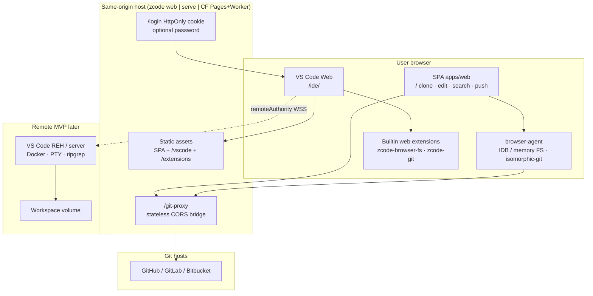
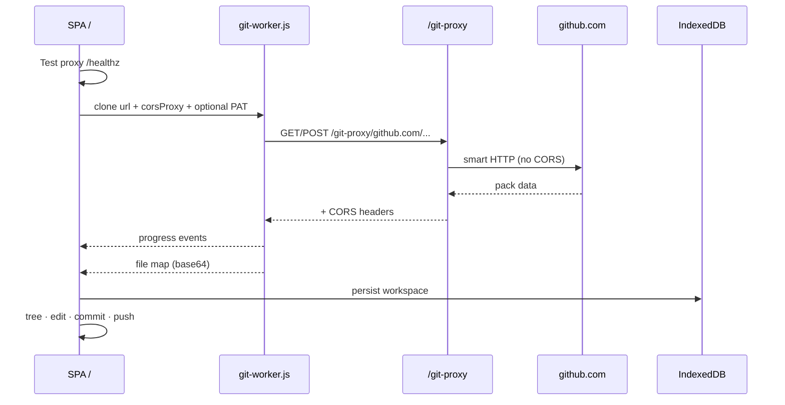
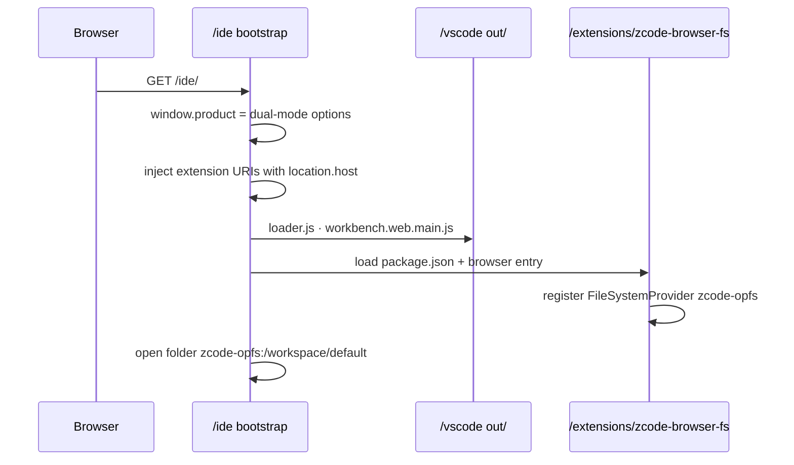

# ZCode — Master Plan, Architecture & Work Tracker

| Field | Value |
| --- | --- |
| **Product** | **ZCode** (CLI `zcode`) |
| **Repo (current)** | `github.com/spinupdev/code-server` |
| **Repo (preferred)** | `github.com/spinupdev/zcode` |
| **Document purpose** | Handoff for **any agent or engineer**: architecture, how systems connect, **done / in progress / remaining** |
| **Last updated** | 2026-07-17 |
| **Canonical design RFC** | [`docs/design-dual-mode-vscode-ide.md`](./docs/design-dual-mode-vscode-ide.md) |
| **VS Code pin** | `1.129.0` → SHA `125df467…` ([`docs/vscode-pin.md`](./docs/vscode-pin.md)) |
| **Status owner** | Update this file’s **Work tracker** whenever a work package finishes or starts |

---

## 1. Product vision (one paragraph)

ZCode is a **VS Code OSS–based IDE that always starts in the browser**, with two modes:

1. **Browser mode** — workspace + git mostly client-side (virtual FS / IndexedDB, isomorphic-git, web extension host). Needs a **stateless HTTP git CORS proxy** for GitHub/GitLab.
2. **Remote mode** — same browser workbench connects to a **VS Code server / REH** in Docker (later microVM) for terminal, native LSPs, system git.

We do **not** invent a parallel editor RPC. Dual-mode is **workbench configuration** (`remoteAuthority`, extension host kinds, FS providers).

---

## 2. How the system works (architecture)

### 2.1 High-level



### 2.2 Request map (local / self-host)

| Path | Role | Stateful? |
| --- | --- | --- |
| `/` | Lightweight SPA: git clone/commit/push, search, IDB workspaces | Client only |
| `/ide/` | **Primary IDE** — VS Code Web host page | Client + optional REH |
| `/vscode/*` | Staged VS Code Web static tree (`dist/vscode-web`) | No |
| `/extensions/*` | Builtin web extensions (`zcode-*`) | No |
| `/git-proxy/*` | CORS proxy for smart HTTP git | **No** (stateless) |
| `/ide/product.json` | Dual-mode `window.product` / create() options | No |
| `/login` · `/healthz` | Password session (serve) | Session cookie in memory |

### 2.3 Browser git data path



**Why proxy exists:** browsers block reading cross-origin responses from GitHub/GitLab git HTTP (no CORS). The proxy is **not** a control plane and **does not** store repos.

### 2.4 VS Code Web load path



### 2.5 Dual-mode workbench config (normative)

| Concern | Browser mode | Remote mode (MVP target) |
| --- | --- | --- |
| UI origin | Always browser | Always browser |
| `remoteAuthority` | unset | `host:port` only (no `zcode+` resolver in MVP) |
| Workspace URI | `zcode-opfs:/workspace/<id>` | `vscode-remote://<authority>/home/workspace` |
| Extension host | Web Worker EH | Web EH + Remote EH |
| Git | isomorphic-git + `/git-proxy` | system `git` on server |
| Terminal | Hidden / false | PTY via REH |
| Auth to REH | n/a | HttpOnly cookie → connection-token (no `?tkn=` in URL) |

### 2.6 Monorepo layout

```text
zcode/  (repo may still be named code-server)
├── PLAN.md                          ← this file (status + architecture)
├── AGENTS.md                        ← short agent entrypoint
├── product/product.json             ← ZCode branding, Open VSX
├── vendor/vscode/                   ← microsoft/vscode @ 1.129.0 submodule
├── patches/                         ← quilt series (empty / minimal)
├── packages/
│   ├── protocol/                    ← mode, capabilities, BrowserAgent IDL
│   ├── shell/                       ← bootstrap + workbench product builder
│   ├── browser-agent/               ← FS, git, search, locks
│   ├── git-proxy/                   ← mountable /git-proxy handler
│   ├── server/                      ← login, cookie bridge, static, optional REH
│   ├── session-api/                 ← post-MVP stub
│   ├── orchestrator/                ← Runtime interface (Docker/Firecracker later)
│   └── auth/                        ← URL secret guards
├── apps/
│   ├── cli/                         ← zcode web | serve | git-proxy
│   ├── web/                         ← SPA clone/edit/search/push
│   └── workbench/                   ← /ide host page + bootstrap
├── extensions/
│   ├── zcode-browser-fs/            ← zcode-opfs FileSystemProvider
│   ├── zcode-git/                   ← open SPA clone command
│   ├── zcode-diagnostics/
│   └── zcode-remote-upgrade/        ← post-MVP stub
├── deploy/
│   ├── cloudflare/git-proxy/        ← Worker for static hosting
│   └── docker/                      ← single-service image
├── scripts/                         ← fetch-vscode-web, build-*, e2e, smoke
└── docs/                            ← design, hosting, vscode-web, pin
```

### 2.7 Runtime processes (today)

```text
One process (preferred local):
  zcode web --port 5000
    ├── static SPA
    ├── /git-proxy  (in-process, stateless)
    ├── /ide + /vscode + /extensions  (if staged)
    └── no REH unless --reh or dist/server artifact

Optional:
  zcode serve --password …   # + login cookie surface
  zcode git-proxy            # standalone proxy (usually unnecessary)
  Cloudflare Worker          # /git-proxy/* on CDN host
```

---

## 3. Key decisions (locked)

| ID | Decision | Notes |
| --- | --- | --- |
| KD1 | Submodule + quilt for VS Code | code-server-style; OpenVSCode = minimal scope philosophy only |
| KD2 | Dual-mode = workbench config, not BackendFacade | |
| KD3 | MVP remote = same-origin co-serve | CDN shell later (OQ10) |
| KD4 | Upstream remote protocol only | |
| KD5 | Browser FS: IDB now; ZenFS/OPFS preferred later | Memory in workers/tests |
| KD6 | Custom SCM / SPA git for browser; Node git on remote | |
| KD8 | HTTP git-proxy only (no SW tunnel) | Same-origin `/git-proxy` |
| KD9 | Open VSX marketplace | |
| KD10 | Docker single-tenant; microVM before multi-tenant SaaS | |
| KD11 | `@vscode/test-web` never production | |
| KD12 | No secrets in URL; HttpOnly cookies | |
| KD17 | Brand ZCode / CLI `zcode` | |
| KD21 | Pin latest stable VS Code at kickoff → **1.129.0** | Dogfood web package may lag |
| KD22 | Track R ∥ Track B parallel | |

---

## 4. Work tracker

**Legend:** `done` · `in_progress` · `remaining` · `blocked` · `deferred`

Update the **Status** column and **Last note** when you finish a package. Prefer atomic commits and point PRs/commits here.

### 4.1 Foundation

| ID | Work package | Status | Last note |
| --- | --- | --- | --- |
| F1 | pnpm/turbo monorepo, CI skeleton | **done** | PR1 |
| F2 | Product naming ZCode, README disambiguation vs coder/code-server | **done** | |
| F3 | `vendor/vscode` submodule pin 1.129.0 + quilt pipeline | **done** | R1; empty series |
| F4 | Design doc approved | **done** | `docs/design-dual-mode-vscode-ide.md` |
| F5 | This master PLAN + AGENTS handoff | **done** | this file |
| F6 | Repo rename → `spinupdev/zcode` | **remaining** | operational |

### 4.2 Track B — Browser

| ID | Work package | Status | Last note |
| --- | --- | --- | --- |
| B1 | Shell bootstrap matrix / mode resolution | **done** | `@zcode/shell` |
| B2 | Browser agent workspace + locks | **done** | Memory + **IndexedDB** |
| B2b | ZenFS + OPFS backend (design primary) | **remaining** | IDB is interim durable store |
| B3 | `zcode-browser-fs` FileSystemProvider | **done** | Seeds sample workspace for `/ide` |
| B4 | isomorphic-git + git-proxy + SPA SCM UX | **done** | Clone/commit/push + PAT |
| B4b | Same-origin `/git-proxy` mount | **done** | CLI web/serve + CF Worker |
| B4c | Private HTTPS (PAT) + push | **done** | sessionStorage token |
| B5 | Best-effort text search | **done** | SPA search |
| B6 | Git Web Worker for responsive clone | **done** | `git-worker.js` |
| B7 | Bridge SPA IDB workspace ↔ workbench `zcode-opfs` | **done** | Same IDB `zcode-fs-v1`; `/ide/?workspace=<id>`; Open in IDE |
| B8 | Full SCM inside workbench (not only SPA) | **remaining** | |
| B9 | SSH remotes / LFS / submodules | **deferred** | non-goals MVP |
| B10 | Offline PWA | **deferred** | OQ7 |

### 4.3 Track R — Remote

| ID | Work package | Status | Last note |
| --- | --- | --- | --- |
| R1 | VS Code submodule + quilt | **done** | |
| R2 | Server/REH build scripts + docs | **done** | scripts exist; full compile rare locally |
| R2b | CI fat-runner REH artifact (workflow_dispatch) | **done** | skeleton in CI |
| R2c | Successful owned REH artifact on main CI path | **remaining** | long pole |
| R3 | Password login + HttpOnly cookie bridge | **done** | no `?tkn=` |
| R3b | Spawn REH + cookie-authorized WS attach | **remaining** | spawn only if artifact/`--reh`; attach incomplete |
| R4 | Docker image + compose | **done** | single service; polish non-root later |
| R5 | CLI `zcode serve` | **done** | |
| R6 | Terminal/LSP verified e2e against REH | **remaining** | needs R2c + R3b |

### 4.4 Merge — Workbench product

| ID | Work package | Status | Last note |
| --- | --- | --- | --- |
| M0a | Stage VS Code Web static assets | **done** | dogfood `vscode-web@1.91.1` via fetch script |
| M0b | `/ide` host + bootstrap + product.json | **done** | |
| M0c | Serve `/vscode` + `/extensions` | **done** | |
| M0d | **Owned** OSS web build at pin 1.129 | **remaining** | replace dogfood package |
| M0e | Bundle/verify zcode-* extensions in workbench | **done** | IDB-backed FS extension bundled into workbench host |
| M1 | Dual-mode remoteAuthority connect end-to-end | **remaining** | product payload ready; REH missing |
| M2 | Diagnostics extension, CSP, log redaction | **remaining** | stubs only |
| M3 | Playwright e2e: routes + SPA clone + IDE product handoff | **done** | `e2e/` + CI job; Buffer polyfill for worker clone; remote terminal still R6 |

### 4.5 Hosting / ops

| ID | Work package | Status | Last note |
| --- | --- | --- | --- |
| H1 | Cloudflare Worker git-proxy | **done** | `deploy/cloudflare/git-proxy` |
| H2 | Hosting docs | **done** | `docs/hosting.md` |
| H3 | Production Pages+Worker deploy runbook tested | **remaining** | |
| H4 | Docker multi-arch / non-root harden | **remaining** | |
| H5 | Observability (metrics, structured logs) | **remaining** | design only |

### 4.6 Post-MVP / SaaS

| ID | Work package | Status | Last note |
| --- | --- | --- | --- |
| P0 | ADR browser↔remote workspace sync | **remaining** | gates upgrade |
| P1 | Browser→remote upgrade | **remaining** | |
| P2 | Session API + OIDC attach codes | **remaining** | package stub |
| P3 | microVM orchestrator (Firecracker) | **remaining** | interface sketch only |
| P4 | Billing metering | **deferred** | |

---

## 5. Recommended work queue for the next agent

Do **not** expand the custom SPA as the product IDE. Prefer VS Code Web + shared agent.

### P0 — Next 1–2 sessions

1. **M0d** — Spike owned `gulp vscode-web` on Node **24** (see vendor `.nvmrc`); document exact tasks that succeed.
2. **R2c / R3b** — REH artifact + cookie-auth attach.
3. **B8** — Browser SCM via `zcode-git` (status/diff/commit in IDE, not only SPA).

### P1 — Remote dogfood

4. **R2c** — Produce `dist/server` REH artifact once on a large machine; commit instructions not binaries.  
5. **R3b** — Cookie-authenticated reverse proxy or connection bridge to REH WS.  
6. **R6** — Terminal `echo ok` e2e.

### P2 — Product polish

7. **M2** CSP + diagnostics.  
8. **F6** Rename repo when ready.

---

## 6. How to run (agent quickstart)

```bash
# deps
pnpm install

# build monorepo packages + SPA + workbench host
pnpm build
pnpm --filter @zcode/workbench build
pnpm --filter zcode-browser-fs build
pnpm --filter zcode-git build

# stage VS Code Web static assets (dogfood npm or owned .build)
./scripts/fetch-vscode-web.sh

# one process: SPA + /git-proxy + /ide + /vscode
node apps/cli/dist/cli.js web --dir apps/web/dist --port 5000
```

| URL | Expect |
| --- | --- |
| http://127.0.0.1:5000/ | SPA: Test proxy → Clone → Commit → Push |
| http://127.0.0.1:5000/ide/ | VS Code Web + `zcode-opfs` sample workspace |
| http://127.0.0.1:5000/git-proxy/healthz | `{"ok":true,"service":"zcode-git-proxy",...}` |

```bash
pnpm test
pnpm e2e:browser      # Node harness: agent clone via same-origin proxy
pnpm e2e:playwright   # Browser UI: routes + SPA clone + IDE product (M3)
pnpm smoke            # lighter checks
```

---

## 7. Invariants (do not regress)

1. **No connection secrets in URLs** (`tkn`, `cc`, `connectionToken` query).  
2. **Git proxy is stateless** — no repo storage on server for browser mode.  
3. **`@vscode/test-web` is never a production asset.**  
4. **Dual-mode is workbench config**, not a custom file/terminal RPC bus.  
5. **MVP multi-tenant untrusted Docker is forbidden** — microVM first.  
6. **Product name is ZCode**; do not confuse with coder/code-server.  
7. Prefer **extensions + wrappers** over deep VS Code patches (quilt only when required).

---

## 8. Open questions (need product input)

| # | Question | Impact |
| --- | --- | --- |
| OQ2 | Dual marketplace (Open VSX + private) for enterprise? | product.json / gallery |
| OQ6 | SaaS billing model | session-api |
| OQ9 | When to rename GitHub repo to `zcode` | branding |
| OQ10 | CDN shell cookie domain for cross-origin remote | blocks full Topology B CDN |
| OQ11 | Dogfood `vscode-web@1.91` vs block on owned 1.129 web | quality vs speed |

---

## 9. Related docs

| Doc | Content |
| --- | --- |
| [`docs/design-dual-mode-vscode-ide.md`](./docs/design-dual-mode-vscode-ide.md) | Full RFC, threat model, original PR plan |
| [`docs/vscode-web.md`](./docs/vscode-web.md) | `/ide` integration |
| [`docs/hosting.md`](./docs/hosting.md) | Static + edge proxy |
| [`docs/building-vscode.md`](./docs/building-vscode.md) | REH/web compile requirements |
| [`docs/vscode-pin.md`](./docs/vscode-pin.md) | Pin SHA / upgrade |
| [`docs/quilt-workflow.md`](./docs/quilt-workflow.md) | Patch discipline |
| [`deploy/cloudflare/README.md`](./deploy/cloudflare/README.md) | Worker deploy |
| [`AGENTS.md`](./AGENTS.md) | Short agent bootstrap |

---

## 10. Change log for this plan file

| Date | Change |
| --- | --- |
| 2026-07-17 | Initial master plan + status snapshot after SPA git, same-origin proxy, `/ide` dogfood VS Code Web, PAT push |
| 2026-07-17 | B7 done: shared IDB `zcode-fs-v1` between SPA and `zcode-browser-fs`; Open in IDE |
| 2026-07-17 | M3 Playwright e2e package + CI job (routes, SPA clone, IDE product); monorepo-root static paths; Buffer polyfill for isomorphic-git worker |

**When you complete work:** set the package **Status** to `done`, add a one-line **Last note** (commit SHA or PR), and append a row to §10.
