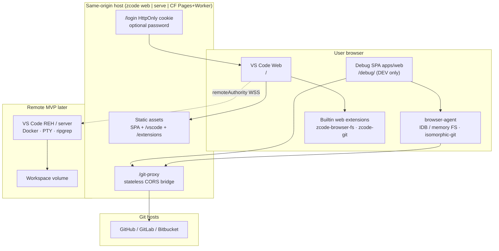
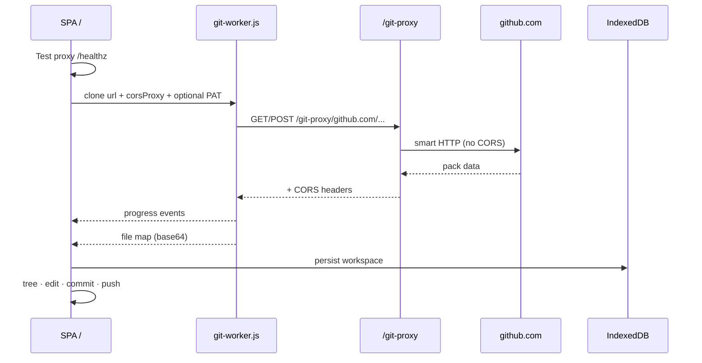
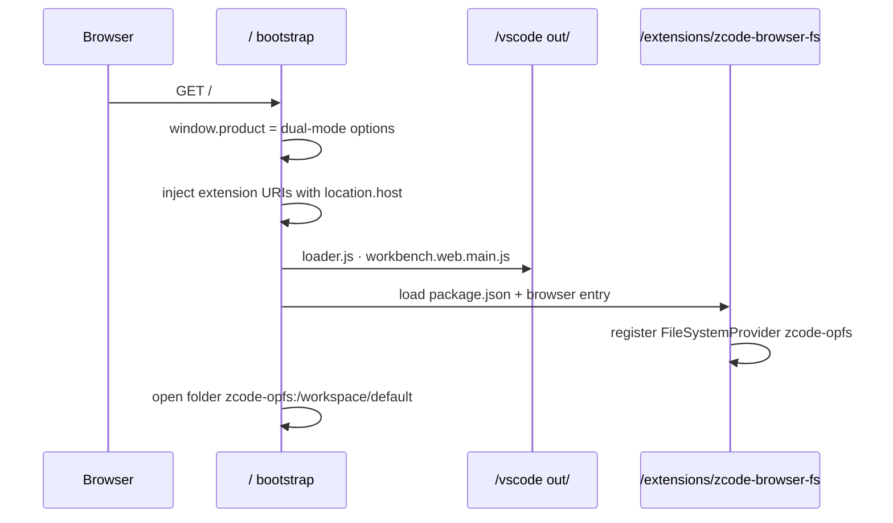

# ZCode — Master Plan, Architecture & Work Tracker

| Field | Value |
| --- | --- |
| **Product** | **ZCode** (CLI `zcode`) |
| **Repo** | [`github.com/spinupdev/zcode`](https://github.com/spinupdev/zcode) |
| **Local path** | may still be checked out as `code-server` — product is **ZCode** |
| **Document purpose** | Handoff for **any agent or engineer**: architecture, how systems connect, **done / in progress / remaining** |
| **Last updated** | 2026-07-27 (walkthrough webviewEndpoint + ZCode branding) |
| **Canonical design RFC** | [`docs/design-dual-mode-vscode-ide.md`](./docs/design-dual-mode-vscode-ide.md) |
| **VS Code pin** | `1.129.0` → SHA `125df467…` ([`docs/vscode-pin.md`](./docs/vscode-pin.md)) |
| **Status owner** | Update this file’s **Work tracker** whenever a work package finishes or starts |

---

## 1. Product vision (one paragraph)

ZCode is a **VS Code OSS–based IDE that always starts in the browser**, with two modes:

1. **Browser mode** — workspace + git mostly client-side (virtual FS / IndexedDB, isomorphic-git, web extension host). Needs a **stateless HTTP git CORS proxy** for GitHub/GitLab.
2. **Remote mode** — same browser workbench connects to a **VS Code server / REH** in Docker (later microVM) for terminal, native LSPs, system git.

We do **not** invent a parallel editor RPC. Dual-mode is **workbench configuration** (`remoteAuthority`, extension host kinds, FS providers).

---

## 2. How the system works (architecture)

### 2.1 High-level


```mermaid
flowchart TB
  subgraph Browser["User browser"]
    SPA["Debug SPA apps/web\n/debug/  (DEV only)"]
    IDE["VS Code Web\n/"]
    Agent["browser-agent\nIDB / memory FS · isomorphic-git"]
    Ext["Builtin web extensions\nzcode-browser-fs · zcode-git"]
  end

  subgraph SameOrigin["Same-origin host (zcode web | serve | CF Pages+Worker)"]
    Static["Static assets\nSPA + /vscode + /extensions"]
    Proxy["/git-proxy\nstateless CORS bridge"]
    Login["/login HttpOnly cookie\noptional password"]
  end

  subgraph RemoteOptional["Remote MVP later"]
    REH["VS Code REH / server\nDocker · PTY · ripgrep"]
    Vol["Workspace volume"]
  end

  subgraph GitHosts["Git hosts"]
    GH["GitHub / GitLab / Bitbucket"]
  end

  SPA --> Agent
  SPA --> Proxy
  IDE --> Ext
  IDE --> Static
  IDE -.->|remoteAuthority WSS| REH
  Proxy --> GH
  Agent --> Proxy
  Login --> IDE
  REH --> Vol
```

### 2.2 Request map (local / self-host)

| Path | Role | Stateful? |
| --- | --- | --- |
| `/` | **Primary IDE** — VS Code Web host page | Client + optional REH |
| `/debug/` | **Debug SPA only** (DEV): git clone/commit/push; off when `NODE_ENV=production` | Client only |
| `/vscode/*` | Staged VS Code Web static tree (`dist/vscode-web`) | No |
| `/extensions/*` | Builtin web extensions (`zcode-*`) | No |
| `/git-proxy/*` | CORS proxy for smart HTTP git | **No** (stateless) |
| `/product.json` | Dual-mode `window.product` / create() options | No |
| `/login` · `/healthz` | Password session (serve) | Session cookie in memory |

### 2.3 Browser git data path


```mermaid
sequenceDiagram
  participant UI as SPA /
  participant W as git-worker.js
  participant P as /git-proxy
  participant G as github.com
  participant IDB as IndexedDB

  UI->>UI: Test proxy /healthz
  UI->>W: clone url + corsProxy + optional PAT
  W->>P: GET/POST /git-proxy/github.com/...
  P->>G: smart HTTP (no CORS)
  G-->>P: pack data
  P-->>W: + CORS headers
  W-->>UI: progress events
  W-->>UI: file map (base64)
  UI->>IDB: persist workspace
  UI->>UI: tree · edit · commit · push
```

**Why proxy exists:** browsers block reading cross-origin responses from GitHub/GitLab git HTTP (no CORS). The proxy is **not** a control plane and **does not** store repos.

### 2.4 VS Code Web load path


```mermaid
sequenceDiagram
  participant B as Browser
  participant H as / bootstrap
  participant V as /vscode out/
  participant E as /extensions/zcode-browser-fs

  B->>H: GET /
  H->>H: window.product = dual-mode options
  H->>H: inject extension URIs with location.host
  H->>V: loader.js · workbench.web.main.js
  H->>E: load package.json + browser entry
  E->>E: register FileSystemProvider zcode-opfs
  H->>H: open folder zcode-opfs:/workspace/default
```

### 2.5 Dual-mode workbench config (normative)

| Concern | Browser mode | Remote mode (MVP target) |
| --- | --- | --- |
| UI origin | Always browser | Always browser |
| `remoteAuthority` | unset | `host:port` only (no `zcode+` resolver in MVP) |
| Workspace URI | `zcode-opfs:/workspace/<id>` | `vscode-remote://<authority>/home/workspace` |
| Extension host | Web Worker EH | Web EH + Remote EH |
| Git | isomorphic-git + `/git-proxy` | system `git` on server |
| Terminal | WASM Pseudoterminal (WebContainer `jsh` / Pyodide REPL) | PTY via REH |
| Auth to REH | n/a | HttpOnly cookie → connection-token (no `?tkn=` in URL) |

### 2.6 Monorepo layout

```text
zcode/  (repo may still be named code-server)
├── PLAN.md                          ← this file (status + architecture)
├── AGENTS.md                        ← short agent entrypoint
├── product/product.json             ← ZCode branding, Open VSX
├── vendor/vscode/                   ← microsoft/vscode @ 1.129.0 submodule
├── patches/                         ← quilt series (empty / minimal)
├── packages/
│   ├── protocol/                    ← mode, capabilities, BrowserAgent IDL
│   ├── shell/                       ← bootstrap + workbench product builder
│   ├── browser-agent/               ← FS, git, search, locks
│   ├── git-proxy/                   ← mountable /git-proxy handler
│   ├── server/                      ← login, cookie bridge, static, optional REH
│   ├── session-api/                 ← post-MVP stub
│   ├── orchestrator/                ← Runtime interface (Docker/Firecracker later)
│   └── auth/                        ← URL secret guards
├── apps/
│   ├── cli/                         ← zcode web | serve | git-proxy
│   ├── web/                         ← SPA clone/edit/search/push
│   └── workbench/                   ← / host page + bootstrap
├── extensions/
│   ├── zcode-browser-fs/            ← zcode-opfs FileSystemProvider
│   ├── zcode-git/                   ← SCM + Open Repository (HTTPS clone in-IDE) |
│   ├── zcode-diagnostics/
│   └── zcode-remote-upgrade/        ← post-MVP stub
├── deploy/
│   ├── cloudflare/git-proxy/        ← Worker for static hosting
│   └── docker/                      ← single-service image
├── scripts/                         ← fetch-vscode-web, build-*, e2e, smoke
└── docs/                            ← design, hosting, vscode-web, pin
```

### 2.7 Runtime processes (today)

```text
One process (preferred local):
  zcode web --port 5000
    ├── static SPA
    ├── /git-proxy  (in-process, stateless)
    ├── / + /vscode + /extensions  (if staged; /debug SPA when DEV)
    └── no REH unless --reh or dist/server artifact

Optional:
  zcode serve --password …   # + login cookie surface
  zcode git-proxy            # standalone proxy (usually unnecessary)
  Cloudflare Worker          # /git-proxy/* on CDN host
```

---

## 3. Key decisions (locked)

| ID | Decision | Notes |
| --- | --- | --- |
| KD1 | Submodule + quilt for VS Code | code-server-style; OpenVSCode = minimal scope philosophy only |
| KD2 | Dual-mode = workbench config, not BackendFacade | |
| KD3 | MVP remote = same-origin co-serve | CDN shell later (OQ10) |
| KD4 | Upstream remote protocol only | |
| KD5 | Browser FS: ZenFS/OPFS primary; IDB fallback | Memory in workers/tests |
| KD6 | Custom SCM / SPA git for browser; Node git on remote | |
| KD8 | HTTP git-proxy only (no SW tunnel) | Same-origin `/git-proxy` |
| KD9 | Open VSX marketplace | |
| KD10 | Docker single-tenant; microVM before multi-tenant SaaS | |
| KD11 | `@vscode/test-web` never production | |
| KD12 | No secrets in URL; HttpOnly cookies | |
| KD17 | Brand ZCode / CLI `zcode` | |
| KD21 | Pin latest stable VS Code at kickoff → **1.129.0** | Dogfood web package may lag |
| KD22 | Track R ∥ Track B parallel | |

---

## 4. Work tracker

**Legend:** `done` · `in_progress` · `remaining` · `blocked` · `deferred`

Update the **Status** column and **Last note** when you finish a package. Prefer atomic commits and point PRs/commits here.

### 4.1 Foundation

| ID | Work package | Status | Last note |
| --- | --- | --- | --- |
| F1 | pnpm/turbo monorepo, CI skeleton | **done** | PR1 |
| F2 | Product naming ZCode, README disambiguation vs coder/code-server | **done** | |
| F3 | `vendor/vscode` submodule pin 1.129.0 + quilt pipeline | **done** | R1; empty series |
| F4 | Design doc approved | **done** | `docs/design-dual-mode-vscode-ide.md` |
| F5 | This master PLAN + AGENTS handoff | **done** | this file |
| F6 | Repo rename → `spinupdev/zcode` | **done** | `origin` = `git@github.com:spinupdev/zcode.git`; `main` pushed |

### 4.2 Track B — Browser

| ID | Work package | Status | Last note |
| --- | --- | --- | --- |
| B1 | Shell bootstrap matrix / mode resolution | **done** | `@zcode/shell` |
| B2 | Browser agent workspace + locks | **done** | Memory + **IndexedDB** |
| B2b | ZenFS + OPFS backend (design primary) | **done** | OPFS primary via ZenFS WebAccess; IDB fallback + migrate; see `docs/b2b-opfs-zenfs.md`; **AgentFs.stat** (ZenFS raw `readFile` can return bytes for dirs) |
| B3 | `zcode-browser-fs` FileSystemProvider | **done** | Explorer type via `fs.stat` (not readFile probe); empty default; restore last workspace; no auto-seed |
| B4 | isomorphic-git + git-proxy + SPA SCM UX | **done** | Clone/commit/push + PAT |
| B4b | Same-origin `/git-proxy` mount | **done** | CLI web/serve + CF Worker |
| B4c | Private HTTPS (PAT) + push | **done** | sessionStorage token |
| B5 | Best-effort text search | **done** | SPA search |
| B6 | Git Web Worker for responsive clone | **done** | `git-worker.js` |
| B7 | Bridge SPA IDB workspace ↔ workbench `zcode-opfs` | **done** | Same IDB `zcode-fs-v1`; `/?workspace=<id>`; Open in IDE |
| B8 | Full SCM inside workbench (not only SPA) | **done** | `zcode-git` status/commit/push via IDB + isomorphic-git |
| B8b | Welcome Open Repository → in-IDE HTTPS clone | **done** | `zcode.git.openRepository` + `remoteHub.openRepository` alias; notification progress; any public HTTPS host via `/git-proxy` `*`; Zeish favicon |
| B8c | Multi-project browser workspaces + first-run clone | **done** | Unique workspace per clone; Browser Projects tree + manage QuickPick; last workspace restore (`localStorage` + `?workspace=`); `storage.persist`; startup clone prompt when empty |
| B8d | Walkthrough media + ZCode branding | **done** | Same-origin `webviewEndpoint` (fix “content is blocked” from vscode-cdn); NLS brand script + `patches/0003-brand-walkthrough-zcode.patch`; docs in `docs/vscode-web.md` |
| B9 | SSH remotes / LFS / submodules | **deferred** | non-goals MVP |
| B10 | Offline PWA | **deferred** | OQ7 |

### 4.3 Track R — Remote

| ID | Work package | Status | Last note |
| --- | --- | --- | --- |
| R1 | VS Code submodule + quilt | **done** | |
| R2 | Server/REH build scripts + docs | **done** | scripts exist; full compile rare locally |
| R2b | CI fat-runner REH artifact (workflow_dispatch) | **done** | skeleton in CI |
| R2c | Successful owned REH artifact on main CI path | **done** | local `vscode-reh-darwin-arm64` → dist/server + server-main.js; quilt without-mangling; CI heavy_build=reh; `pnpm fetch:reh` for Linux CI artifact |
| R3 | Password login + HttpOnly cookie bridge | **done** | no `?tkn=` |
| R3b | Spawn REH + cookie-authorized WS attach | **done** | cookie→token HTTP/WS proxy; spawn uses `--connection-token` |
| R4 | Docker image + compose | **done** | single service; polish non-root later |
| R5 | CLI `zcode serve` | **done** | |
| R6 | Terminal/LSP verified e2e against REH | **done** | STRICT workbench green; PTY via shortcuts+palette + `printf zcode_echo_ok`; hard-fail with `ZCODE_E2E_REH_PTY_REQUIRED=1` |

### 4.4 Merge — Workbench product

| ID | Work package | Status | Last note |
| --- | --- | --- | --- |
| M0a | Stage VS Code Web static assets | **done** | dogfood `vscode-web@1.91.1` via fetch script |
| M0b | `/` host + bootstrap + product.json | **done** | |
| M0c | Serve `/vscode` + `/extensions` | **done** | |
| M0d | **Owned** OSS web build at pin 1.129 | **done** | `vscode-web-ci` esbuild → dist/vscode-web source=owned; dual bootstrap (ESM/AMD); CI heavy_build=web |
| M0e | Bundle/verify zcode-* extensions in workbench | **done** | IDB-backed FS extension bundled into workbench host |
| M0f | Default theme/icons (GitHub + vscode-icons) | **done** | `window.autoDetectColorScheme` + GitHub Light/Dark Default; `workbench.iconTheme=vscode-icons`; `pnpm fetch:themes` |
| M1 | Dual-mode remoteAuthority connect end-to-end | **done** | shell product builder + capabilities; session gate; e2e dual-mode product |
| M2 | Diagnostics extension, CSP, log redaction | **done** | zcode-diagnostics copyReport; CSP on HTML; redactSecrets tests |
| M3 | Playwright e2e: routes + SPA clone + IDE product handoff | **done** | `e2e/` + CI job; Buffer polyfill for worker clone; remote terminal still R6 |

### 4.5 Hosting / ops

| ID | Work package | Status | Last note |
| --- | --- | --- | --- |
| H1 | Cloudflare Worker git-proxy | **done** | `deploy/cloudflare/git-proxy` |
| H2 | Hosting docs | **done** | `docs/hosting.md` |
| H3 | Production Pages+Worker deploy runbook tested | **done** | live: Pages `zcode-69r.pages.dev` + Worker `zcode-git-proxy.*.workers.dev`; `pnpm deploy:cloudflare` |
| H4 | Docker multi-arch / non-root harden | **done** | non-root 10001, tini, healthcheck, compose harden, `scripts/docker-build.sh` multi-arch, `deploy/docker/README.md` |
| H5 | Observability (metrics, structured logs) | **remaining** | design only |

### 4.6 Server-agnostic IDE (same-origin · live attach · WASM)

Product north star: **IDE does not depend on a server**. Same-origin only. See ADRs.

| ID | Work package | Status | Last note |
| --- | --- | --- | --- |
| SA0 | ADR server-agnostic IDE | **done** | `docs/adr/0001-server-agnostic-ide.md` |
| SA1 | ADR browser↔remote workspace sync | **done** | `docs/adr/0002-browser-remote-workspace-sync.md` (was P0) |
| SA2 | Protocol: ExecutionBackend + ConnectionState | **done** | `@zcode/protocol` `execution.ts` |
| RA0 | Spike: remote attach without reload | **done** | no-go mid-session authority; Tier1 reload + WASM; RA3 = execution-only later |
| RA1 | `zcode-remote` extension (connect/disconnect) | **done** | `extensions/zcode-remote` Tier 1 reload attach |
| RA2 | Tier 1 seamless attach (state-preserving reload) | **done** | save dirty + continuity + `?mode=remote`; full OPFS→server sync still WS1 |
| RA3 | Execution-only remote (no reload) | **done** | `POST /v1/exec` + `zcode-runtime-remote` |
| RA4 | Status bar / diagnostics for backend + connection | **done** | runtime + remote status bars |
| RA5 | E2E browser → connect remote | **done** | `connect-flow.spec.ts` + workspace-sync exec on e2e:reh |
| WB0 | Runtime provider interface (shared) | **done** | `zcode-runtime-core` + `globalThis.zcodeRuntime` |
| WB1 | `zcode-runtime-python` (Pyodide) | **done** | CDN Pyodide; Run File; **Pseudoterminal REPL** |
| WB2 | `zcode-runtime-node` (+ WebContainers) | **done** | WebContainers (auto) + worker fallback; **`jsh` Pseudoterminal** |
| WB3–WB6 | Run UX, FS bridge, CSP, e2e | **done** | Run UX + CSP; dual-mode e2e extensions; import API on e2e:reh |
| WB7 | Browser integrated terminal (Pseudoterminal) | **done** | WC shell + Pyodide REPL; terminal profiles; browser `terminal: true` |
| WS1 | Workspace import API + connect upload (files-v1) | **done** | `POST /v1/workspace/import` · zcode-remote upload before reload |
| WS2 | Pre-attach flush dirty editors | **done** | part of zcode-remote connect |
| WS3 | Detach remote→browser OPFS pull | **done** | zcode-remote disconnect: export → applyFilesV1 → reload browser |

### 4.7 Post-MVP / SaaS

| ID | Work package | Status | Last note |
| --- | --- | --- | --- |
| P0 | ADR browser↔remote workspace sync | **done** | → SA1 / ADR 0002 |
| P1 | Browser→remote upgrade / live attach | **done** | RA1–RA5 + WS1–WS3 shipped (Tier1 + exec-only) |
| P2 | Session API + OIDC attach codes | **remaining** | package stub; not needed for same-origin |
| P3 | microVM orchestrator (Firecracker) | **remaining** | interface sketch only |
| P4 | Billing metering | **deferred** | |
| OQ10 | Cross-origin CDN shell cookies | **deferred** | same-origin product path accepted |

---

## 5. Recommended work queue for the next agent

Do **not** expand the custom SPA as the product IDE. Prefer VS Code Web + shared agent.

**North star:** server-agnostic IDE (ADR 0001). Same-origin remote. WASM run without REH. Live attach via extensions.

### P0 — Next 1–2 sessions

Server-agnostic core (SA/RA/WB/WS through RA5 + WebContainers multi-file) is **shipped**. Prefer polish:

1. Dogfood **WebContainer Shell** + **Pyodide REPL** Pseudoterminals; tune COI / mount limits.  
2. Optional: interactive REH PTY without full attach (beyond `/v1/exec`).  
3. Optional: UI Playwright for **Run File** / open shell (API/connect e2e already on `e2e:reh`).

### P1 — Ops / parallel

1. ~~CI PTY hard-fail on heavy REH~~ → **done** (`reh-and-e2e` sets STRICT + `ZCODE_E2E_REH_PTY_REQUIRED=1`).  
2. Optional custom domain on Pages + Worker.  
3. Optional SPA git-worker OPFS dual-open coordinator.  
4. **H5** observability when ops needs it.

---

## 6. How to run (agent quickstart)

```bash
# one command: install (if needed) + fetch vscode-web/themes + turbo build + serve
pnpm dev
```

| URL | Expect |
| --- | --- |
| http://127.0.0.1:5000/ | VS Code Web + `zcode-opfs` sample workspace |
| http://127.0.0.1:5000/debug/ | Debug SPA (DEV): Test proxy → Clone → Commit → Push |
| http://127.0.0.1:5000/git-proxy/healthz | `{"ok":true,"service":"zcode-git-proxy",...}` |

```bash
pnpm test
pnpm e2e:browser      # Node harness: agent clone via same-origin proxy
pnpm e2e:playwright   # Browser UI: routes + SPA clone + IDE product (M3)
pnpm smoke            # lighter checks
```

---

## 7. Invariants (do not regress)

1. **No connection secrets in URLs** (`tkn`, `cc`, `connectionToken` query).  
2. **Git proxy is stateless** — no repo storage on server for browser mode.  
3. **`@vscode/test-web` is never a production asset.**  
4. **Dual-mode is workbench config**, not a custom file/terminal RPC bus.  
5. **MVP multi-tenant untrusted Docker is forbidden** — microVM first.  
6. **Product name is ZCode**; do not confuse with coder/code-server.  
7. Prefer **extensions + wrappers** over deep VS Code patches (quilt only when required).

---

## 8. Open questions (need product input)

| # | Question | Impact |
| --- | --- | --- |
| OQ2 | Dual marketplace (Open VSX + private) for enterprise? | product.json / gallery |
| OQ6 | SaaS billing model | session-api |
| OQ9 | ~~When to rename GitHub repo to `zcode`~~ | **done** — `spinupdev/zcode` |
| OQ10 | ~~CDN shell cookie domain for cross-origin remote~~ | **deferred** — same-origin path accepted (ADR 0001) |
| OQ11 | Dogfood `vscode-web@1.91` vs block on owned 1.129 web | quality vs speed |

---

## 9. Related docs

| Doc | Content |
| --- | --- |
| [`docs/design-dual-mode-vscode-ide.md`](./docs/design-dual-mode-vscode-ide.md) | Full RFC, threat model, original PR plan |
| [`docs/vscode-web.md`](./docs/vscode-web.md) | `/` workbench integration |
| [`docs/hosting.md`](./docs/hosting.md) | Static + edge proxy |
| [`docs/building-vscode.md`](./docs/building-vscode.md) | REH/web compile requirements |
| [`docs/m0d-owned-web-spike.md`](./docs/m0d-owned-web-spike.md) | Owned web package spike + session log |
| [`docs/reh-cookie-proxy.md`](./docs/reh-cookie-proxy.md) | R3b cookie → REH token proxy |
| [`docs/r6-terminal-e2e.md`](./docs/r6-terminal-e2e.md) | R6 terminal e2e / skip policy |
| [`docs/m1-dual-mode.md`](./docs/m1-dual-mode.md) | Dual-mode remoteAuthority product |
| [`docs/m2-diagnostics-csp.md`](./docs/m2-diagnostics-csp.md) | Diagnostics, CSP, redaction |
| [`docs/hosting-production.md`](./docs/hosting-production.md) | H3 Pages+Worker production checklist |
| [`deploy/docker/README.md`](./deploy/docker/README.md) | H4 Docker non-root / multi-arch |
| [`docs/b2b-opfs-zenfs.md`](./docs/b2b-opfs-zenfs.md) | B2b OPFS primary + IDB fallback |
| [`docs/plan-server-agnostic-ide.md`](./docs/plan-server-agnostic-ide.md) | **Active plan** — WASM runtimes + live attach |
| [`docs/adr/0001-server-agnostic-ide.md`](./docs/adr/0001-server-agnostic-ide.md) | SA0 — IDE without server; same-origin; backends |
| [`docs/adr/0002-browser-remote-workspace-sync.md`](./docs/adr/0002-browser-remote-workspace-sync.md) | SA1 — bundle/tar sync for Tier 1 attach |
| [`docs/spikes/remote-attach-no-reload.md`](./docs/spikes/remote-attach-no-reload.md) | RA0 — no-reload feasibility |
| [`docs/vscode-pin.md`](./docs/vscode-pin.md) | Pin SHA / upgrade |
| [`docs/quilt-workflow.md`](./docs/quilt-workflow.md) | Patch discipline |
| [`deploy/cloudflare/README.md`](./deploy/cloudflare/README.md) | Worker deploy |
| [`AGENTS.md`](./AGENTS.md) | Short agent bootstrap |
| [`RESUME.md`](./RESUME.md) | Paste-ready agent resume / handoff prompt |

---

## 10. Change log for this plan file

| Date | Change |
| --- | --- |
| 2026-07-17 | Initial master plan + status snapshot after SPA git, same-origin proxy, `/ide` dogfood VS Code Web, PAT push |
| 2026-07-17 | B7 done: shared IDB `zcode-fs-v1` between SPA and `zcode-browser-fs`; Open in IDE |
| 2026-07-17 | M3 Playwright e2e package + CI job (routes, SPA clone, IDE product); monorepo-root static paths; Buffer polyfill for isomorphic-git worker |
| 2026-07-17 | B8 workbench SCM (`zcode-git`); R3b cookie→REH HTTP/WS proxy; M0d `build-web.sh --package/--spike` + spike docs |
| 2026-07-17 | M0d: Node24 check/spike; deps blocked by ripgrep 403; CI `heavy_build=web`. R2c CI Node24+token+disk. R6 `pnpm e2e:reh` skip-safe + mock terminal-flow tests |
| 2026-07-17 | **M0d done**: `vscode-web-ci` owned esbuild staged; workbench dual bootstrap; quilt copilot type patch for compile; R2c/R6 harness continue |
| 2026-07-17 | **R2c done**: owned REH `dist/server` (darwin-arm64) with server-main.js. **R6 done**: Playwright REH suite green; preserve owned web in fetch/e2e |
| 2026-07-17 | **M1 done**: dual-mode product + capabilities + session gate. **M2 done**: diagnostics extension, CSP HTML headers, log redaction |
| 2026-07-17 | STRICT remote e2e green; REH without-connection-token; `/login` route; workspacePath alignment; H3 production runbook |
| 2026-07-18 | CI Linux REH download: `scripts/fetch-reh-artifact.sh` + `pnpm fetch:reh`; reh-and-e2e normalize (+x/flatten) |
| 2026-07-18 | **B2b done**: ZenFS OPFS primary (`createDefaultFsAsync`), IDB migrate/fallback; SPA + zcode-browser-fs + zcode-git |
| 2026-07-18 | **F6 done**: remote `origin` → `github.com/spinupdev/zcode`; `main` pushed |
| 2026-07-18 | **R6 PTY polish**: terminal open via shortcuts+palette; `printf zcode_echo_ok`; `ZCODE_E2E_REH_PTY_REQUIRED=1` hard-fail. **H3** `scripts/hosting-dry-run.sh`. **H4 done**: non-root Docker, multi-arch build script, compose harden |
| 2026-07-18 | Verified M0d (`source=owned` + `--check`), R2c (`dist/server` + `--check`), `ZCODE_E2E_REH_STRICT=1 pnpm e2e:reh` 4/4 green |
| 2026-07-18 | SPA `/` is **debug only**: `isSpaDebugEnabled` gates serve; production redirects `/` → `/ide/`; `ZCODE_SPA_DEBUG` / `--spa-debug` overrides |
| 2026-07-18 | Product IDE moved to **`/`**; debug SPA at **`/debug/`** |
| 2026-07-18 | Removed legacy `/ide` routes (IDE is only `/`) |
| 2026-07-18 | **H3 live**: Cloudflare Pages + Worker + same-origin Pages Function; `scripts/deploy-cloudflare.sh` |
| 2026-07-18 | **B8b**: Welcome **Open Repository** → in-IDE HTTPS clone (`zcode.git.openRepository` + `remoteHub.openRepository`); notification progress/errors; git-proxy default allow `*` (SSRF still blocked); Zeish favicon (`product/icon.svg`) replaces VS Code `favicon.ico` |
| 2026-07-18 | **RESUME.md**: paste-ready agent handoff reflecting `/` IDE, `/debug` SPA, H3–H4 done, §5 next queue |
| 2026-07-18 | **SA0–SA2 done**: ADR 0001 server-agnostic IDE; ADR 0002 workspace sync; `@zcode/protocol` execution backends + connection state. **RA0** spike baseline. Queue → WASM runtimes + `zcode-remote` Tier 1. OQ10 deferred. |
| 2026-07-18 | **WB0–WB2 + RA1/RA2**: `zcode-runtime-core/python/node`, `zcode-remote` connect; plan at `docs/plan-server-agnostic-ide.md`; CSP allows Pyodide CDN |
| 2026-07-18 | **WS1**: files-v1 import/export routes; connect uploads OPFS before remote reload; seed `hello.py`/`hello.js` |
| 2026-07-18 | **WS3 + RA0**: disconnect pulls remote→OPFS; RA0 concluded no mid-session remoteAuthority; e2e workspace-sync on reh config |
| 2026-07-18 | **RA3**: `/v1/exec` + zcode-runtime-remote. **RA5**: connect-flow e2e. **WB2+**: WebContainers node engine + worker fallback; optional `ZCODE_COI=1` |
| 2026-07-18 | **WB2 multi-file**: OPFS→WebContainer mount + auto npm install + npm run commands; **CI** `reh-and-e2e` enables STRICT + `ZCODE_E2E_REH_PTY_REQUIRED=1` |
| 2026-07-25 | **B8b fix**: clone dialog stuck + Explorer empty after clone — share OPFS/ZenFS via `globalThis` across extension bundles; `zcode.fs.ready` (no toast); revealWorkspace reload `?workspace=` fallback; return openRepository promise |
| 2026-07-25 | **B8b fix**: SCM showed clone, Explorer empty — gate FileSystemProvider on FS ready; `notifyTree` + refresh after clone; clone into *open* workspace folder; never seed over `.git` |
| 2026-07-25 | **B8b fix**: clone “gone” / hung after URL — OPFS init timeout→IDB; progress before agent; unstick openRepoBusy; literal globalThis FS keys (esbuild-safe) |
| 2026-07-25 | Empty default workspace (no hello.* seed); TextMate language packs via `product/language-extensions.json` + additionalBuiltinExtensions; Default Dark Modern theme |
| 2026-07-27 | Syntax highlight root cause: stale `zcode web` without `dist/vscode-web` → `/vscode/extensions/*` 404; server logs grammar path; tryStatic path-resolve harden; product serves 85 builtins |
| 2026-07-27 | **Monochrome editor**: owned web missing `node_modules/vscode-oniguruma` (TextMate WASM). Added `scripts/stage-vscode-web-node-modules.sh`; bootstrap uses Default Dark Modern |
| 2026-07-27 | Terraform + Nix TextMate packs (`extensions/terraform`, `extensions/nix`); restore GitHub Theme + vscode-icons as product defaults on reload |
| 2026-07-27 | Expanded Open VSX language packs (HCL, Kotlin, Scala, Elixir, Haskell, Solidity, Zig, Fortran, COBOL, …) via `product/extra-language-extensions.json` |
| 2026-07-27 | **M0f**: default file icons `vscode-icons`; color theme GitHub Light/Dark Default via `window.autoDetectColorScheme`; `pnpm fetch:themes` stages Open VSX VSIX into `extensions/` |
| 2026-07-27 | **B8c**: multi-project browser repos — first-run clone dialog, Browser Projects view, manage/switch/delete, unique workspace id per clone, last project restore via localStorage + OPFS/IDB, `navigator.storage.persist()` |
| 2026-07-27 | **WB7**: browser integrated terminal via Pseudoterminal — WebContainer `jsh` + Pyodide REPL; terminal profiles; browser `terminal: true`; Open Browser Shell command |

**When you complete work:** set the package **Status** to `done`, add a one-line **Last note** (commit SHA or PR), and append a row to §10.
