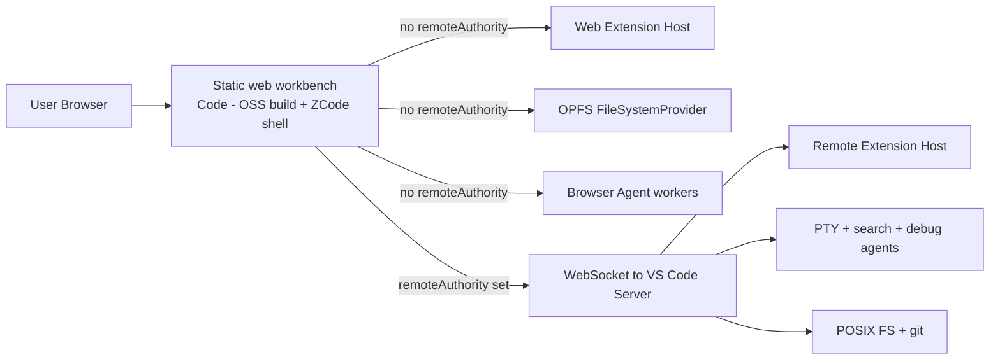
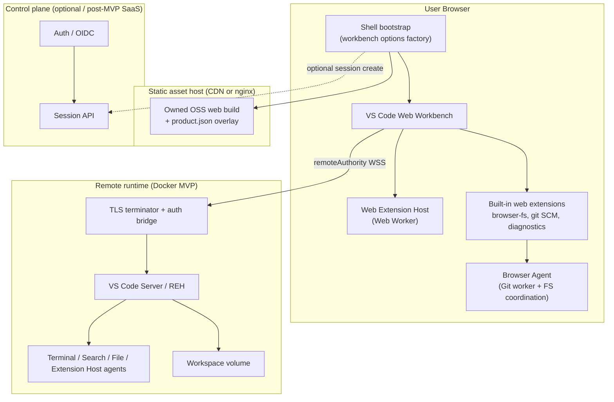
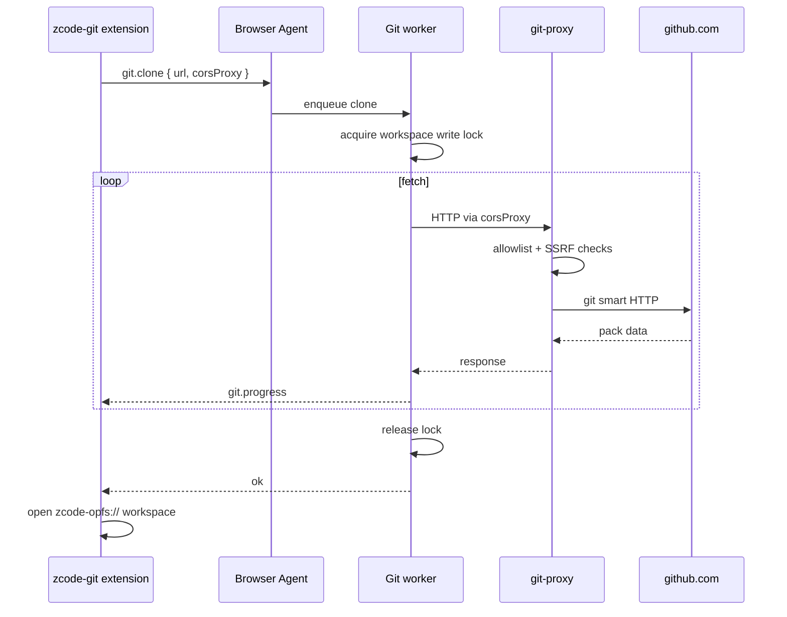
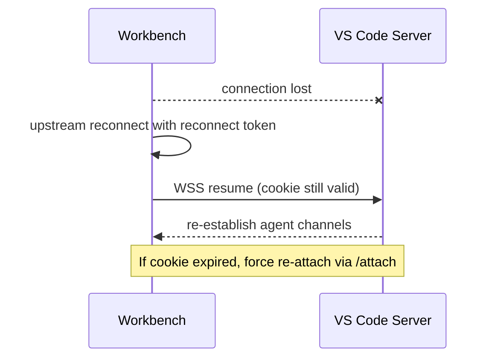

# Dual-Mode VS Code Browser IDE (ZCode)

| Field | Value |
| --- | --- |
| **Document** | Dual-Mode VS Code-based Browser IDE Architecture |
| **Author** | spinupdev / TBD |
| **Date** | 2026-07-17 |
| **Revised** | 2026-07-17 (user decisions: naming ZCode, VS Code pin, parallel tracks) |
| **Status** | **Approved for implementation** (user decisions locked 2026-07-17) |
| **Repo (current)** | `github.com/spinupdev/code-server` (greenfield) |
| **Repo (preferred rename)** | `github.com/spinupdev/zcode` |
| **Product** | **ZCode** (user-facing brand) · CLI **`zcode`** · images `ghcr.io/spinupdev/zcode-*` |
| **Related** | Product vision: browser-only (serverless) + remote Docker modes; microVM = post-MVP |

---

## Overview

This document specifies the architecture for **ZCode** (current repo path `spinupdev/code-server`; preferred rename `spinupdev/zcode`): a dual-mode, VS Code OSS–based browser IDE. The product always instantiates the **IDE UI in the browser**. It can operate in two modes:

1. **Browser / serverless mode** — workspace, git, and a web extension host run entirely client-side (OPFS via ZenFS + isomorphic-git + web workers). No remote compute is required for editing, file tree, best-effort search, SCM, and browser-capable extensions.
2. **Remote server mode** — a Node-based VS Code server runs inside a Docker container (MVP). The browser workbench connects with a **`remoteAuthority`** over WebSocket and uses a **remote extension host**, PTY terminal, native language servers, and full filesystem/git tooling.

Both modes share **one static web workbench build** (MVP: same-origin co-serve with the server; post-MVP: optional CDN) and one monorepo. Mode is not a product-owned “backend facade” that answers file/terminal/extension-host RPCs. Mode is **workbench configuration**: presence/absence of `remoteAuthority`, which extension host kinds start, which `FileSystemProvider`s register, and which agent channels (search, terminal, debug) exist.

The design follows Microsoft’s post-2019 browser/remote architecture (vscode.dev, github.dev, Codespaces, OpenVSCode Server / code-server server layouts). Integration mechanics for patches follow **coder/code-server’s submodule + quilt** model; change-minimization philosophy follows **OpenVSCode Server**.

**MVP cut line (explicit):** remote Docker CLI self-host (**same-origin co-serve** of workbench + REH) + browser public-git clone/edit/commit on owned OSS web build, with a **user-run or product-hosted `zcode git-proxy`** for non-CORS git hosts (not a full control plane). **Not in MVP:** cross-origin CDN shell + separate runtime host, SaaS multi-tenant session API GA, microVM runtime, browser→remote upgrade automation, private-git OAuth proxy at scale.

The repository is currently empty aside from a README. This document is the blueprint for building the system end-to-end.

---

## Assumptions

| Assumption | Value | Notes |
| --- | --- | --- |
| Team size | **2–3 full-time engineers** (default planning) | Adjust PR parallelism if smaller |
| MVP target | **~2–3 calendar quarters** after kickoff | VS Code build ownership is the long pole |
| CI | Linux runners with **≥64GB disk**, **≥8 vCPU**, multi-hour job timeout for VS Code compile | Cache yarn deps + build outputs aggressively |
| Remote OS | **Linux amd64 only** for MVP server images | arm64 later |
| Control plane | **Optional** for self-host; required only for SaaS features | No Session API/OIDC for browser public clone or CLI remote |
| Git CORS proxy | **Required for browser clone** of non-CORS hosts (GitHub/GitLab smart HTTP) | Small `zcode git-proxy` process (user-run or product-hosted)—**not** a control plane; pure static SPA alone cannot demo real git clone against those hosts |
| Untrusted multi-tenant SaaS | **Out of MVP**; requires microVM appendix before GA | Docker = single-tenant / trusted self-host only |

---

## Background & Motivation

### Current state of the art

| Product | Model | Extension host | Integration mechanism | Notes |
| --- | --- | --- | --- | --- |
| **vscode.dev / github.dev** | Pure browser | Web extension host | Microsoft product | Virtual FS / GitHub Repos ext; no terminal; local folder via File System Access API |
| **coder/code-server** | Server-only | Node (server) | **`microsoft/vscode` submodule + quilt patches**; product code outside tree | Open VSX; password auth; high extension compatibility; reference for **our patch workflow** |
| **gitpod-io/openvscode-server** | Server-only | Node (server) | **Direct fork** of VS Code; minimal *scope* of changes committed in-tree | Same architecture family as Codespaces/Gitpod; reference for **server entry / minimal surface** |
| **StackBlitz WebContainers** | Browser compute | Proprietary IDE + WASM Node | Proprietary | Full Node in-browser; not VS Code extension compatible |
| **Eclipse Theia** | Browser + remote | Theia plugin host | Independent | VS Code-compatible API subset; not full marketplace parity |
| **Microsoft VS Code Server / Tunnels** | Desktop or web → remote | Remote extension host | Mixed closed/open | Standalone server + tunnels to vscode.dev |

### Pain points this product addresses

1. **No dual-mode open product** — Open projects are server-only (code-server, openvscode-server) or browser-only (vscode.dev). Users cannot start serverless and promote a workspace to remote compute without switching products.
2. **Fork maintenance cost** — In-tree permanent forks require rebasing the entire VS Code history. A **submodule + quilt patch series** (as code-server practices) keeps upstream history clean and upgrades mechanical.
3. **Extension ecosystem is the moat** — Reimplementing an IDE sacrifices Marketplace/Open VSX compatibility.
4. **Cost & latency for simple editing** — Browser mode should be free/cheap and instant; remote is opt-in for builds, LSPs, and terminals.

### Why dual-mode with one workbench build



Mode is **workbench configuration + navigation**, not two separate IDEs. Product chrome (welcome, clone UX, “Open in Remote”) lives in built-in web extensions and a thin shell bootstrap—not a parallel RPC bus for editor services.

---

## Goals & Non-Goals

### Goals

1. **VS Code fidelity** — Productized build of VS Code OSS (web + server/REH); Open VSX for extensions.
2. **Dual mode via workbench wiring** — Same static workbench assets; browser mode without `remoteAuthority`; remote mode with `remoteAuthority` + authenticated management connection.
3. **Submodule + quilt** — `vendor/vscode` pins `microsoft/vscode`; patches in `patches/` applied with **quilt** (code-server-style).
4. **Browser mode MVP** — Shallow-clone public git repos in-browser, edit, multi-file, best-effort search, custom SCM provider for commit/push, persist in OPFS, install **web extensions**.
5. **Remote mode MVP** — Dockerized VS Code server, workspace folder, full terminal, remote EH, language servers; CLI `zcode serve`.
6. **Security baseline** — HTTPS/WSS; **no long-lived connection tokens in GET/list APIs**; short-lived exchange codes or HttpOnly cookies; single-tenant Docker only until microVM.
7. **Incremental delivery** — Parallel remote-dogfood and browser tracks; explicit MVP cut line.

### Non-Goals (MVP / v1)

- Full StackBlitz-class WebContainers.
- Microsoft Marketplace as default (Open VSX).
- Multi-user collaborative editing.
- Every desktop-only extension in browser mode.
- **Multi-tenant untrusted SaaS on Docker** (shared kernel).
- MicroVM production runtime (interface sketch only; see Appendix D).
- Automated browser→remote upgrade (requires ADR; post-MVP unless ADR lands early).
- Mobile-first UI.
- Non-VS Code editor backends.
- **Production use of `@vscode/test-web` Microsoft web bits** (dev/test only).

---

## Proposed Design

### 1. High-level architecture



**Invariant:** Editor services (files, terminal, search, EH) are always VS Code’s own services. ZCode product code **configures** them and adds browser-mode providers; it does not replace the remote protocol with a custom `BackendFacade`.

### 2. VS Code integration strategy

#### Decision: submodule + quilt patches (code-server mechanics) + minimal change scope (OpenVSCode philosophy)

| Approach | Pros | Cons | Verdict |
| --- | --- | --- | --- |
| **A. `vendor/vscode` submodule + quilt patches** (code-server) | Clean upstream history; mechanical upgrades; external product packages | Need VS Code build expertise; patches break on bump | **Primary** |
| **B. Direct fork, minimal commits in-tree** (openvscode-server) | Simple mental model for “just VS Code + bits” | Full-tree fork UX; harder to keep product code separate | Reference for *what* to change, not *how* we store it |
| **C. Consume only prebuilt openvscode-server / code-server binaries** | Fast remote dogfood | Weak productization; dual-mode control limited | **Bootstrap only** (dev/dogfood), not production ownership |
| **D. Theia / custom Monaco** | Clean multi-mode abstractions | Extension ecosystem gap | Reject |

**Correct attribution:**

- **code-server** = submodule of VS Code + **quilt** patch series + substantial product wrappers. Study: `patches/`, quilt workflow, CI build.
- **openvscode-server** = fork with **minimal scope** of server/web enablement changes committed directly. Study: server entry, connection token env service, release layout.

Our KD: **code-server-style integration mechanics** + **OpenVSCode-style patch minimality** (prefer extensions and wrappers over core edits).

#### Patch tooling: quilt only for `vendor/vscode`

| Tool | Use |
| --- | --- |
| **quilt** | **Only** supported mechanism for patches under `patches/` applied to `vendor/vscode` |
| `git am` | Optional alternate for maintainers who export quilt series; not the documented default |
| **patch-package** | **Do not use** for the VS Code submodule (it targets `node_modules`) |

Developer workflow (mirror code-server CONTRIBUTING spirit):

```bash
./scripts/sync-vscode.sh          # submodule update --init, quilt push -a
cd vendor/vscode
quilt new 000N-my-change.patch
# edit files
quilt refresh
cd ../..
# commit patches/ + any series file
```

CI job `vscode-patches`: fresh submodule checkout + `quilt push -a` must succeed.

#### Phased ownership of builds

1. **Phase 0 (dev only):** `@vscode/test-web` downloads Microsoft web bits for **extension unit tests and local harness**. **Never ship in production images.** CI asserts production artifacts do not contain `.vscode-test-web/`.
2. **Phase 0 remote dogfood:** Official `gitpod/openvscode-server` (or code-server) Docker image behind our CLI wrapper to validate product UX—not final binary.
3. **Phase 1:** Pin **`microsoft/vscode` to the latest stable release tag available at kickoff** (exact tag + commit SHA recorded in `.gitmodules` / docs when PR R1 lands); own **web** + **server/REH** builds; Open VSX `product.json`; ZCode built-in extensions bundled.
4. **Phase 2:** Thin quilt patches only where wrappers cannot reach (gallery, base path, auth bridge hooks).

**VS Code pin strategy (decided):** always start from **latest stable** at implementation kickoff—not Insiders, not a floating `main`. PR **R1** is the moment the pin becomes concrete (e.g. `1.xx.y` + full SHA). Subsequent upgrades follow the upgrade procedure in this document (bump tag → quilt refresh → smoke).

#### What we patch vs leave upstream

| Change | Location | Rationale |
| --- | --- | --- |
| Product name, icons, welcome, telemetry off | `product.json` overlay / patch | Branding |
| Extension gallery → Open VSX | `product.json` | License |
| Connection token cookie bridge / base path | Server wrapper in `packages/server` first; patch only if required | Prefer wrapper |
| Browser FS / SCM / diagnostics | **Built-in web extensions** | No core FS rewrite |
| Dual-mode bootstrap (workbench options) | `packages/shell` + web entry contribution | Product UX |
| Built-in extension set for web vs server | product / build packaging | Feature parity control |

#### Build targets

| Target | Runtime | Role |
| --- | --- | --- |
| Browser workbench | Browser main thread | IDE UI both modes |
| Web extension host | Web Worker | Browser-mode + UI extensions |
| Server / REH | Node.js | Remote mode agents |
| Shared common | Both | Models, IPC types |

#### Extension compatibility matrix

| Extension class | Browser mode | Remote mode |
| --- | --- | --- |
| Themes, snippets, grammars (declarative) | ✅ | ✅ |
| Web extensions (`browser` entry) | ✅ Web Worker EH | ✅ UI side when `extensionKind` allows |
| Node workspace extensions (`main` only) | ❌ | ✅ Remote EH |
| Debuggers / terminal needing shell | ❌ | ✅ |
| Native language servers | ❌ unless WASM | ✅ |
| JS/WASM LSP in worker | ✅ | ✅ |
| Docker / K8s / remote-SSH | ❌ | Partial (privileges) |

**Remote extension kind resolution:** Product must configure extension kind preferences (`extensionKind`, `remote.extensionKind` equivalents in product/settings) so UI extensions stay local and workspace extensions install on the REH. This is **not** automatic merely because a server process exists—follow VS Code Remote Development rules and verify in smoke tests.

**Built-in extensions to ship:**

| Built-in / bundled | Browser web build | Remote server build |
| --- | --- | --- |
| Themes, git-base (as applicable), language basics | ✅ | ✅ |
| JSON/HTML/CSS language features (web builds) | ✅ **required** for claimed web LS | ✅ |
| TypeScript/JavaScript (web where available) | Best-effort if web entry exists | ✅ full |
| `zcode-browser-fs`, `zcode-git`, `zcode-diagnostics` | ✅ | Optional (no-op or hidden) |
| `zcode-remote-upgrade` | ✅ (command; post-MVP enable) | n/a |
| Native git extension (Node) | **Disabled / excluded** | ✅ system git |
| Terminal / debug core | N/A (no backend) | ✅ |

Also not in browser MVP: **Git LFS**, **git submodules** (document; fail with clear error), **SSH remotes**.

#### Upstream upgrade procedure

```text
1. Read VS Code release notes (web/server)
2. Bump submodule to tag; record SHA
3. quilt push -a; fix conflicts; quilt refresh
4. Rebuild web + server; smoke suite
5. Bump bundled extensions / Open VSX smoke
6. Tag zcode-x.y.z+vscode.a.b.c
```

### 3. Dual-mode architecture (implementable)

#### 3.1 Deployment topology (Key Decision)

**Wiring model (both MVP and later SaaS): Topology B** — one productized static web workbench; mode is presence/absence of `remoteAuthority` (not two separate IDE codebases).

| Topology | Description | Trade-off |
| --- | --- | --- |
| **A. Server-served matching web+REH** | Each remote process serves its own workbench HTML (classic openvscode-server) | Perfect version skew avoidance; harder CDN; browser mode is a *separate* static app |
| **B. Static shell + remoteAuthority** ✅ | Static OSS web build; browser mode has no authority; remote mode sets `remoteAuthority` and opens management WebSocket | Single shell; **must pin/negotiate server commit compatibility**; version skew is a first-class concern |

##### Normative deployment split (do not collapse these)

| Phase | How assets + runtime are hosted | In scope for |
| --- | --- | --- |
| **MVP remote (normative)** | **Same-origin co-serve only:** CLI/Docker process serves workbench static files **and** REH/server from the **same release tarball** (openvscode/code-server deployment reality). Cookie bind, login form, and WS share one origin. | PR R3–R5, M1 |
| **MVP browser** | Static shell (same release or dev harness) + optional separate **`zcode git-proxy`** process for CORS; no REH | Track B, M0 |
| **Post-MVP SaaS remote** | **CDN (or separate static host) shell + cross-origin runtime authority** only after **OQ10 ADR** (same-site reverse proxy **or** documented cookie/`connectCode` handoff without query secrets). Do **not** implement full cross-origin Topology B in M1. | After self-host GA |

Same-origin MVP **preserves Topology B wiring** (`remoteAuthority` set vs unset in the workbench) while avoiding CDN/cookie-domain complexity. PR **M1 must not** take a hard dependency on cross-origin CDN + separate runtime host.

**Version skew policy:**

- Server advertises `vscodeCommit` / product version on handshake.
- Shell refuses connect if server outside compatible range (same minor recommended; exact commit match ideal for dogfood).
- **MVP:** co-served tarball ⇒ shell and server always match; skew checks are still implemented for future CDN.
- **Post-MVP CDN:** may lag one minor; enforce compatibility matrix in Session API / shell.

#### 3.2 Product session controller (not BackendFacade)

Demote any “backend facade that answers file/terminal/EH RPCs.” Product owns:

```ts
// packages/protocol/src/session.ts
/** Product-level session only — does NOT proxy VS Code file/terminal/EH IPC */
export interface SessionController {
  readonly mode: 'browser' | 'remote';
  /** Build IWorkbench construction options / web embed config for this mode */
  createWorkbenchLoadConfig(): WorkbenchLoadConfig;
  capabilities(): ProductCapabilities; // UI only
  /** Browser→remote upgrade orchestration (product RPC, not editor IPC) */
  requestRemoteUpgrade?(opts: UpgradeOpts): Promise<RemoteConnectInfo>;
  dispose(): void;
}

export interface ProductCapabilities {
  terminal: boolean;
  remoteExtensions: boolean;
  webExtensions: boolean;
  nativeGit: boolean;
  browserGit: boolean;
  debug: boolean;
  search: 'ripgrep' | 'web-best-effort' | 'none';
  fileWatcher: 'native' | 'polling' | 'none';
  maxWorkspaceBytes?: number;
}

export interface WorkbenchLoadConfig {
  /**
   * MVP: hostname or host:port only, e.g. "localhost:8080" or "ses-1.runtime.example.com".
   * Do NOT use custom prefixes like "zcode+..." in MVP — that implies a RemoteAuthorityResolver
   * we are not building yet (post-MVP SaaS only if needed).
   */
  remoteAuthority?: string;
  workspaceUri?: string; // zcode-opfs://... or vscode-remote://<authority>/home/workspace
  /**
   * After redeemRemoteAccess(): in-memory product state only.
   * { ready: true } means HttpOnly session cookie (or localhost escape hatch) is in place;
   * the workbench must NOT receive a long-lived connection token string here.
   */
  resolvedConnection?: ConnectionHandle;
  productConfiguration?: Record<string, unknown>;
  additionalBuiltinExtensions?: string[];
  developmentOptions?: { /* test only */ };
}

/** Product-only; not passed as a VS Code connectionToken init string in MVP. */
export type ConnectionHandle = { ready: true; authority: string };
```

VS Code still owns `IFileService`, remote agent clients, EH managers, etc.

**MVP connection wiring (normative for PR R3 / M1):**

1. User completes same-origin **password login** (CLI) or authenticated **`POST /attach`** (future SaaS).
2. Server wrapper sets **HttpOnly Secure** cookie that maps to the internal `--connection-token` (cookie never exposes the raw server secret to JS).
3. Shell calls `create({ remoteAuthority: "localhost:8080" /* or hostname */, ... })` with **no token in the URL and no token field in workbench options**.
4. Browser sends cookie on the management WebSocket (same-origin). Wrapper validates cookie → allows the upstream connection-token check.
5. `ConnectionHandle` is only an in-memory `{ ready: true, authority }` flag so the shell does not boot remote mode before login; it is **not** an alternate IPC secret channel.

**Localhost escape hatch (dev only):** print one-shot connect material to stdout; may use fragment or stripped `sessionStorage` handoff—never long-lived `?tkn=` in docs as the default path.

**Post-MVP cross-origin:** if CDN shell ≠ runtime host, solve via OQ10 (reverse proxy same-site **or** short-lived body/`sessionStorage` redeem)—not via inventing `zcode+` authorities without a resolver design.

#### 3.3 Workbench bootstrap matrix

| Concern | Browser mode | Remote mode |
| --- | --- | --- |
| **Entry** | `packages/shell` loads static workbench (`workbench-web` product entry from OSS build) | Same entry HTML/JS |
| **`remoteAuthority`** | **unset / empty** | Set to session host (see URL design) |
| **Extension hosts** | Web Worker EH only | Web EH for UI + **Remote EH** on server |
| **Workspace URI** | `zcode-opfs://workspace/<id>/` (or `vscode-vfs` alias we register) | `vscode-remote://<authority>/home/workspace` (or server default folder) |
| **FileSystemProvider** | `zcode-browser-fs` registers OPFS provider | Remote file provider via agent (upstream) |
| **Search** | Web text search / custom `FileSearchProvider` + `TextSearchProvider` over OPFS (no ripgrep) | Remote search agent (ripgrep on server) |
| **File watch** | Polling / coarse OPFS invalidation in provider | Native watcher via server |
| **Terminal** | Capability false; panel hidden (`when` clauses) | PTY via remote agent |
| **SCM** | Custom `zcode-git` SCM provider (isomorphic-git) | Built-in Git + system `git` |
| **Debug** | Hidden / unsupported | Upstream remote debug |
| **Connection** | None | Management WebSocket + connection token redeem (below) |
| **Built-in git (Node)** | Excluded from web product | Included |

**Shell bootstrap pseudocode:**

```ts
async function main() {
  // Prefer clean URLs: mode + authority + session id only — no secrets in query
  const session = await resolveSessionFromUrl(); // mode, workspace id, remote host:port
  const controller = session.mode === 'remote'
    ? new RemoteSessionController(session)
    : new BrowserSessionController(session);

  let load = controller.createWorkbenchLoadConfig();

  if (session.mode === 'remote') {
    // Same-origin MVP: login form or prior cookie; redeem may POST body connectCode then strip it
    // Prefer: cookie already set → ConnectionHandle.ready without URL secrets
    load = {
      ...load,
      resolvedConnection: await redeemRemoteAccess(session),
    };
    if (!load.resolvedConnection?.ready) {
      showLoginUi(); // sets HttpOnly cookie, then location.replace without secrets
      return;
    }
  }

  // Pinned OSS web factory — no connectionToken option in MVP; cookie authenticates WS
  await create(document.body, {
    remoteAuthority: load.remoteAuthority, // e.g. "localhost:8080"
    workspaceProvider: { /* open load.workspaceUri */ },
    // productConfiguration from overlay
    // additionalBuiltinExtensions: zcode-* web extensions for browser mode
  });
}
```

*Note: Exact `create()` API follows the OSS web workbench factory used at the pinned VS Code version (see Appendix E). Do not invent a parallel embed API.*

#### 3.4 Browser → remote navigation flow

**MVP:** User starts a remote session separately (CLI URL or control plane). Optional “Open in Remote” copies git remote URL and opens remote with `git clone` on server—not automatic OPFS sync until ADR.

**Post-MVP upgrade (after ADR):**

```mermaid
sequenceDiagram
  participant U as User
  participant W as Workbench browser mode
  participant SC as SessionController
  participant API as Session API optional
  participant S as VS Code Server

  U->>W: Command zcode.remote.upgrade
  W->>SC: requestRemoteUpgrade(exportPlan)
  SC->>SC: export OPFS as git bundle or tar (see KD sync)
  alt control plane
    SC->>API: POST /v1/sessions (no token in response body long-lived)
    API-->>SC: sessionId + attach URL
    SC->>API: POST /v1/sessions/{id}/attach (cookie session)
    API-->>SC: Set-Cookie session_bind; short-lived connect_code
  else self-host upload
    SC->>S: authenticated upload endpoint
  end
  SC->>W: navigate to clean attach URL (no secret in query)
  Note over W: connectCode via sessionStorage or POST body only if cookie not yet set
  W->>S: exchange → HttpOnly cookie + WS (cookie on subsequent requests)
  Note over W,S: Workbench boots with remoteAuthority host:port; workspace on server
```

**URL shapes (no secrets in query in production):**

| Mode | URL example |
| --- | --- |
| Browser empty | `https://ide.example.com/?mode=browser` |
| Browser workspace | `https://ide.example.com/?mode=browser&ws=<uuid>` |
| Remote attach (clean) | `https://ide.example.com/?mode=remote&session=ses_...&authority=ses-1.runtime.example.com` |
| Self-host CLI | `http://127.0.0.1:8080/?mode=remote&authority=localhost:8080` after same-origin login sets cookie |

**Connect-code handoff preference (normative):**

1. **Best (MVP same-origin):** login / `/attach` sets **HttpOnly cookie**, then `location.replace` to a **clean** URL with **no** `cc` / `tkn` query.
2. **Acceptable:** write one-time code to **`sessionStorage`**, immediately `history.replaceState` to strip any accidental query, redeem via POST, then clear storage.
3. **Acceptable fallback:** URL **fragment** `#cc=...` (not sent to server access logs on navigation request); redeem once and clear fragment.
4. **Dev-only escape hatch:** `?cc=` or `?tkn=` on **localhost** only—same policy as long-lived `?tkn=` ban for SaaS.

**Anti-patterns:** long-lived `?tkn=` in production URLs; production `?cc=` that lands in history/Referer/proxy logs. Logs must still redact `tkn`, `cc`, `password` if they ever appear.

#### 3.5 Protocol layer

**Core editor IPC (remote):** Use upstream VS Code **remote agent** protocol only—do not invent parallel file/terminal RPCs.

Wire-level (implementers should read at pin; names stable in spirit):

| Concern | Upstream area (Code - OSS) | Notes |
| --- | --- | --- |
| Server entry / args | `src/vs/server/node/` (`server.main`, environment service) | `--connection-token`, `--host`, `--port` |
| Socket / management connection | server connection + `remote` authority client in workbench | WebSocket transport |
| Channel RPC | `vs/base/parts/ipc` + remote agent channels | Binary + JSON mixed framing historically |
| Reconnection | workbench remote agent reconnection token flows | Product should not disable without reason |
| Token validation | server connection token middleware | Prefer cookie bridge wrapper |

**Auth handshake — MVP same-origin (normative):**

```mermaid
sequenceDiagram
  participant B as Browser
  participant W as zcode-server wrapper same origin
  participant S as VS Code Server core

  B->>W: GET / or /login form
  B->>W: POST /login password
  W-->>B: Set-Cookie zcode_sess=...; HttpOnly; Secure; SameSite=Lax
  W-->>B: 302 Location: /?mode=remote&authority=localhost:8080
  Note over B: Clean URL — no cc/tkn in query
  B->>W: WSS management (Cookie: zcode_sess)
  W->>W: map cookie → internal connection-token
  W->>S: allow agent connection
  S-->>B: management connection OK
  Note over B,S: Reconnect uses upstream reconnect token bound to cookie session
```

**Auth handshake — post-MVP attach API (optional control plane; still no query secrets):**

```mermaid
sequenceDiagram
  participant B as Browser
  participant Edge as Edge/API
  participant S as VS Code Server

  B->>Edge: Authenticated POST /v1/sessions/{id}/attach
  Edge->>Edge: Authorize user owns session
  Edge-->>B: Set-Cookie zcode_sess=...; HttpOnly; Secure; SameSite=Lax
  Edge-->>B: JSON body { connectCode?, expiresIn, authority } 
  Note over B: If connectCode returned, store in sessionStorage only — never put in ?cc=
  B->>B: location.replace clean IDE URL without secrets
  B->>S: WSS with cookie (preferred) or one-time body redeem then cookie
  S-->>B: management connection OK
```

**Self-host CLI without control plane:** password login form on same origin sets HttpOnly cookie; server wrapper validates cookie ↔ connection token mapping. Optional one-shot material printed once to **stdout** for headless automation (not the long-lived server secret; not the default browser URL).

**Capability / version negotiation:**

```ts
interface ServerHello {
  productVersion: string;
  vscodeCommit: string;
  protocolVersion: number;
  capabilities: { terminal: true; search: true; /* ... */ };
}
```

Shell compares `protocolVersion` and `vscodeCommit` against compatibility table embedded at build time.

**Browser Agent** is **not** on the remote IPC bus. It is product code invoked by ZCode web extensions via `postMessage` to workers + in-page services.

##### BrowserAgent RPC IDL (draft)

```ts
// packages/protocol/src/browser-agent-idl.ts
// Transport: MessageChannel to Git worker / FS coordinator; not VS Code IPC

export type BrowserAgentRequest =
  | { method: 'workspace.create'; params: { name?: string } }
  | { method: 'workspace.list'; params: {} }
  | { method: 'workspace.delete'; params: { id: string } }
  | { method: 'git.clone'; params: {
      workspaceId: string;
      url: string;
      ref?: string;
      depth?: number;
      corsProxy?: string; // absolute HTTPS URL to HTTP proxy; NOT service worker
    }}
  | { method: 'git.status'; params: { workspaceId: string } }
  | { method: 'git.commit'; params: { workspaceId: string; message: string; paths?: string[] } }
  | { method: 'git.push' | 'git.pull'; params: { workspaceId: string; remote?: string } }
  | { method: 'fs.exportBundle'; params: { workspaceId: string; format: 'git-bundle' | 'tar' } }
  | { method: 'diagnostics.snapshot'; params: {} };

export type BrowserAgentEvent =
  | { event: 'git.progress'; data: { phase: string; loaded: number; total?: number } }
  | { event: 'git.error'; data: { code: GitErrorCode; message: string } };

export type GitErrorCode =
  | 'CORS'
  | 'AUTH'
  | 'QUOTA'
  | 'UNSUPPORTED_LFS'
  | 'UNSUPPORTED_SUBMODULE'
  | 'NETWORK'
  | 'LOCKED'
  | 'INTERNAL';

export type BrowserAgentResponse =
  | { ok: true; result: unknown }
  | { ok: false; code: GitErrorCode | 'BAD_REQUEST' | 'NOT_FOUND'; message: string };
```

**Backpressure:** clone progress events throttled (~100ms); git worker is single-threaded queue (one mutating op at a time). FS provider awaits lock (see §3.6).

##### Service Worker vs HTTP git proxy — MVP decision

**MVP: HTTP CORS proxy only.** isomorphic-git’s `corsProxy` option expects an **HTTP proxy base URL**, not Service Worker request rewriting.

| Approach | MVP? | Role |
| --- | --- | --- |
| **HTTPS git proxy** (`corsProxy: https://proxy...`) | ✅ **Required path for non-CORS remotes** | Simple; matches isomorphic-git; SSRF controls on server |
| Service Worker rewrite | ❌ Not MVP | Optional later for asset caching only; **do not** use SW as git proxy tunnel in v1 |

Service Worker may cache **static workbench assets** only.

#### 3.6 File system abstraction

| Scheme | Mode | Implementation |
| --- | --- | --- |
| `vscode-remote://` | Remote | Upstream remote FS |
| `zcode-opfs://workspace/<id>/...` | Browser | ZenFS OPFS backend + `FileSystemProvider` |
| `file://` (File System Access API) | Browser optional post-MVP | vscode.dev local folder pattern |

##### Key Decision: ZenFS + OPFS backend + dedicated git worker

| Option | Pros | Cons | Verdict |
| --- | --- | --- | --- |
| LightningFS (IndexedDB) | Classic isomorphic-git pairing | Not OPFS; weaker large-file story | Reject as primary |
| Raw OPFS + hand-rolled fs Promise API | Max control | Reimplement Node fs subset; more bugs | Reject as primary |
| **ZenFS + `@zenfs/dom` OPFS backend** | Node-like fs for isomorphic-git; OPFS durability | Younger stack; test hard | **Adopt** |

**Consistency / locking:**

- Single **FS mutex** per workspace (AsyncMutex in FS coordinator).
- Mutating git ops (`clone`, `commit`, `merge`) hold write lock; `FileSystemProvider` write/delete waits.
- Reads may proceed in parallel only if ZenFS backend allows; default serialize read+write if uncertain.
- Git worker owns isomorphic-git; main thread provider talks to coordinator via RPC—**no dual open ZenFS roots on same OPFS path**.

**Safari:** OPFS and worker access differ; include Safari in matrix; degrade to “browser mode unsupported” banner if APIs missing.

**Quota:** `navigator.storage.persist()`; soft warn at 200MB; hard fail clone with `QUOTA`.

#### 3.7 Browser IDE feature parity (search / watch / SCM)

This subsection closes the gap between “edit multi-file” and a believable IDE.

| Feature | Strategy | MVP quality |
| --- | --- | --- |
| **Text search** | Implement `TextSearchProvider` / use web workbench search path over `vscode.workspace.fs` enumeration; **no ripgrep**. Respect ignore globs via simple matcher (not full gitignore fidelity). Cap: skip files > 1MB; cancel on timeout; warn if workspace file count > N (e.g. 5000). | **Best-effort** |
| **File search (Quick Open)** | Build in-memory path index on clone + incremental updates on FS writes; full rescan on focus if generation mismatch | **Good for small/medium repos** |
| **File watch** | Provider fires coarse change events on our own write path; **polling** every 2–5s for multi-tab same OPFS (best-effort); no recursive native watch | **Limited** |
| **SCM** | **Replace** Node Git extension in browser builds with **`zcode-git` custom SCM provider** (`vscode.scm.createSourceControl`) backed by isomorphic-git | **Commit/push/pull/diff basic** |
| **Built-in Git extension** | **Excluded** from browser product; **enabled** remote | Clear split |
| **Diff** | Use isomorphic-git read blob + VS Code diff editor APIs | Basic unstaged/staged |
| **Merge conflicts** | Manual file edit only in MVP; no mergetool | Documented limit |

Update honest limits: search is **not** desktop-class.

#### 3.8 Git (browser vs remote)

| Concern | Browser | Remote |
| --- | --- | --- |
| Implementation | isomorphic-git | system `git` |
| HTTP | `isomorphic-git/http/web` + **HTTP corsProxy** | native |
| Auth | OAuth via optional control plane → short-lived token in memory; public clone without auth | credential helper / secrets |
| Default clone | `depth: 1`, `singleBranch: true` | full optional |
| LFS / submodules / SSH | **Unsupported** (explicit errors) | if installed / configured |
| Proxy | Product-hosted or self-host binary `zcode git-proxy` with **host allowlist** | n/a |

#### 3.9 Terminal & language features

| Mode | Terminal | EH / LSP |
| --- | --- | --- |
| Remote | xterm.js + node-pty (upstream) | UI local + workspace remote; native LSPs |
| Browser | **None in MVP** | Web EH only; JSON/HTML/CSS built-ins if packaged; WASM LS optional later |

### 4. Browser-only backend

#### Process topology

| Component | Where | Responsibility |
| --- | --- | --- |
| Workbench | Main thread | UI |
| Web Extension Host | Worker | Extensions |
| Git worker | Worker | isomorphic-git queue |
| FS coordinator | Worker or main (single choice: **worker**) | ZenFS OPFS + lock |
| Service Worker | Optional | **Static asset cache only** |

#### Clone sketch (aligned with ZenFS)

```ts
import git from 'isomorphic-git';
import http from 'isomorphic-git/http/web';
import { configureZenFsOpfs } from './fs/zenfs-opfs';

export async function cloneRepo(opts: CloneOpts, lock: WorkspaceLock) {
  await lock.withWrite(async () => {
    const fs = await configureZenFsOpfs(opts.workspaceId);
    await git.clone({
      fs,
      http,
      dir: '/',
      url: opts.url,
      ref: opts.ref,
      singleBranch: true,
      depth: opts.depth ?? 1,
      corsProxy: opts.corsProxy, // https://git-proxy.example.com
      onAuth: opts.getAuth,
      onProgress: opts.onProgress,
    });
  });
}
```

#### Persistence & export

- OPFS path: `/workspaces/<uuid>/`.
- Metadata IndexedDB: name, remote URL, last opened.
- **Export format (portability + upgrade):**
  - `git bundle create` equivalent via isomorphic-git where possible, else **tar of worktree + `.git`**.
  - File: `zcode-workspace-v1.tar` with `manifest.json` (`{ version: 1, gitUrl, ref, createdAt }`).
- GDPR: delete OPFS tree + IDB row; document user export command `zcode.workspace.export`.

#### Honest limits

| Capability | Status |
| --- | --- |
| Edit, multi-file | ✅ |
| Quick Open index | ✅ small/medium |
| Text search | ⚠️ best-effort, no ripgrep |
| File watch | ⚠️ coarse / polling |
| Git clone/commit/push HTTP | ✅ with proxy/auth caveats |
| SCM UX | ✅ via custom provider (subset) |
| Web extensions | ✅ |
| Native Node/npm/addons | ❌ |
| Real shell / Docker / native debug | ❌ |
| Multi-GB monorepos | ❌ |
| SSH git / LFS / submodules | ❌ |
| Desktop-class search | ❌ |

### 5. Remote backend

#### Packaging tiers

| Tier | Isolation | MVP? |
| --- | --- | --- |
| **Docker container** | Namespaces/cgroups | **Yes — single-tenant / self-host** |
| **microVM** | Hardware virt | **No — Appendix D interface only; required before multi-tenant SaaS GA** |
| **Kubernetes** | Orchestration | Later |

#### Process layout (container)

```text
/usr/lib/zcode-server/     # staged REH/server + optional co-located static web
  bin/zcode-server
/home/workspace
```

Flags: `--host`, `--port`, `--connection-token-file`, `--server-base-path`, `--default-folder`.

#### Session discovery (self-host MVP)

CLI starts container/process, runs password or token setup, opens browser to same-origin static+server. No Session API required.

#### Session API (optional control plane — post-MVP SaaS sketch, token-safe)

```http
POST /v1/sessions
Authorization: Bearer <oidc>
Idempotency-Key: <uuid>
Content-Type: application/json

{
  "workspace": { "source": "git", "url": "https://github.com/org/repo.git", "ref": "main" },
  "resources": { "cpu": "2", "memory": "4Gi", "disk": "20Gi" },
  "image": "ghcr.io/spinupdev/zcode-node:1.99"
}

→ 201
{
  "id": "ses_...",
  "status": "provisioning",
  "endpoints": {
    "ide": "https://ide.example.com/?mode=remote&session=ses_..."
  }
  // NO connectionToken field
}
```

```http
GET /v1/sessions/{id}
→ {
  "id": "ses_...",
  "status": "running",
  "vscodeCommit": "abc123",
  "expiresAt": "...",
  "endpoints": { "ide": "https://ide.example.com/?mode=remote&session=ses_..." }
  // NO secrets
}
```

```http
POST /v1/sessions/{id}/attach
Authorization: Bearer <oidc>
→ 200
Set-Cookie: zcode_sess=...; HttpOnly; Secure; SameSite=Lax; Path=/
{
  "authority": "ses-1.runtime.example.com",
  "expiresIn": 60
  // Optional: "connectCode" only when cookie cannot be set cross-site;
  // client MUST use sessionStorage/fragment redeem — never ?cc= in production
}
```

Preferred: **cookie alone** is sufficient for same-site attach; `connectCode` is optional and **must not** be placed in URL query. Server connection secret never leaves the runtime trust boundary except into cookie-bound validation.

**Session vs workspace state machine:**

```text
Workspace (durable volume metadata) ──has many──> Sessions (running runtimes)
States: workspace { active | archived | deleted }
        session   { provisioning | running | idle | hibernated | stopped | failed }

Multi-tab: multiple tabs MAY share one session (same cookie + reconnect token).
Policy: last-writer-wins on settings; terminal tabs are separate PTYs per VS Code norms.
Idempotency: POST /sessions with Idempotency-Key returns same session if in-flight/recent.
```

#### Auth model

| Layer | Mechanism |
| --- | --- |
| Edge | TLS; OIDC for SaaS |
| IDE connect | HttpOnly session cookie (MVP); optional one-time code via body/`sessionStorage` only; upstream reconnect tokens |
| Secrets | Injected in VM/container; not in browser |
| Network | Egress policy; no Docker socket to user |

#### Multi-tenant isolation

- Docker MVP: **single-tenant trusted self-host only**.
- SaaS multi-tenant: **blocked on microVM** (Appendix D). Risk remains Critical until then.

### 6. Repo layout & monorepo structure

```text
zcode/                                # preferred repo name (current clone may still be code-server/)
├── README.md                         # product ZCode; disambiguate vs coder/code-server
├── package.json
├── pnpm-workspace.yaml
├── turbo.json
├── .gitmodules
├── patches/                          # quilt series for vendor/vscode
│   └── series
├── vendor/
│   └── vscode/
├── packages/
│   ├── protocol/                     # SessionController types, BrowserAgent IDL, compatibility table
│   ├── shell/                        # workbench bootstrap / options factory
│   ├── browser-agent/                # ZenFS OPFS, git worker, locks (shared lib)
│   ├── server/                       # Node wrapper, cookie↔token bridge, static co-host
│   ├── git-proxy/                    # HTTP CORS proxy with host allowlist
│   ├── session-api/                  # optional control plane
│   ├── orchestrator/                 # Docker runtime; Runtime interface for future microVM
│   └── auth/                         # OIDC, connect codes
├── extensions/
│   ├── zcode-browser-fs/            # FileSystemProvider (uses browser-agent lib)
│   ├── zcode-git/                   # SCM provider + clone commands
│   ├── zcode-diagnostics/           # copyReport command
│   └── zcode-remote-upgrade/        # post-MVP
├── apps/
│   ├── web/                          # staged static workbench
│   └── cli/                          # zcode CLI
├── deploy/docker/
├── scripts/
│   ├── sync-vscode.sh                # submodule + quilt push -a
│   ├── build-web.sh
│   ├── build-server.sh
│   └── smoke.sh
└── docs/
    ├── architecture.md
    ├── adr/                          # e.g. adr-001-workspace-sync.md
    └── extension-compatibility.md
```

**Package boundary cleanup:**

- **No** `packages/browser-fs` duplicate — only `extensions/zcode-browser-fs` + `packages/browser-agent` shared library.
- `packages/server` = **wrapper + packaging**, not a fork of VS Code server sources.
- `packages/telemetry` deferred until a PR needs it (no empty package).

**Naming (decided 2026-07-17):**

| Surface | Name |
| --- | --- |
| User-facing brand | **ZCode** |
| CLI binary | **`zcode`** |
| Preferred GitHub repo | **`github.com/spinupdev/zcode`** (rename from `code-server` when ready; org stays `spinupdev`) |
| Built-in extensions | `zcode-browser-fs`, `zcode-git`, `zcode-diagnostics`, `zcode-remote-upgrade` |
| Container images | `ghcr.io/spinupdev/zcode-server`, `ghcr.io/spinupdev/zcode-node`, etc. |
| VS Code product.json | `nameShort`/`nameLong`: ZCode; `applicationName`: `zcode`; `dataFolderName`: `.zcode` |

README must state this is **not** [coder/code-server](https://github.com/coder/code-server).

### 7. API / CLI

#### CLI

```bash
zcode serve ./my-project --port 8080 --auth password
zcode git-proxy --port 8787 --allow-hosts github.com,gitlab.com
zcode web --dir dist/web --port 5000   # dev static only
```

#### Built-in commands

- `zcode.git.clone` / SCM UI actions  
- `zcode.workspace.export` / `zcode.workspace.openRecent`  
- `zcode.diagnostics.copyReport`  
- `zcode.remote.upgrade` (post-MVP, ADR-gated)  
- `zcode.mode.showCapabilities`

### 8. Data model

```sql
users (id, email, oidc_sub, created_at)
workspaces (
  id, user_id, name, git_url, git_ref,
  volume_id, created_at, last_opened_at, status
)
sessions (
  id, user_id, workspace_id, status,
  runtime_type, /* docker | firecracker */
  endpoint_authority,
  token_hash,           -- hash of server connection secret (never raw in API responses)
  reconnect_epoch,
  expires_at, idle_at,
  cpu_millis, memory_bytes,
  idempotency_key UNIQUE
)
audit_events (id, user_id, type, payload_json, at)
```

Browser-only: IndexedDB + OPFS; export via `zcode-workspace-v1.tar`.

---

## Alternatives Considered

### Alt 1: Ship only remote mode (wrap openvscode-server)

- **Pros:** Fast full IDE.  
- **Cons:** No serverless vision.  
- **Verdict:** Bootstrap only.

### Alt 2: Theia / custom Monaco + LSP

- **Pros:** Clean abstractions.  
- **Cons:** Extension gap.  
- **Verdict:** Reject.

### Alt 3: WebContainers as browser backend

- **Pros:** Real Node in browser for JS.  
- **Cons:** Scope/license/complexity.  
- **Verdict:** Optional post-MVP experiment.

### Alt 4: Deep in-tree VS Code fork only

- **Pros:** Unlimited patches.  
- **Cons:** Upgrade hell.  
- **Verdict:** Reject; use quilt submodule.

### Alt 5: github.dev-style virtual git without full clone

- **Pros:** Fast huge repos.  
- **Cons:** Weak git semantics / upgrade story.  
- **Verdict:** Later “quick open”; MVP real clone depth=1.

### Alt 6: Fork/extend **coder/code-server** and add browser mode

- **Pros:** Submodule+quilt+server packaging **already solved**; auth, Open VSX, CI build cache lessons; could collapse PR remote track by months.  
- **Cons:** Inherits code-server product opinions and patch set (may fight dual-mode static shell); trademark/name confusion if we stay “code-server”; license is MIT but community expectations differ; browser mode still net-new (OPFS/SCM/search) on top; coupling to their release cadence.  
- **Effort comparison:** Remote dogfood **S→M** vs greenfield **L**; dual-mode still **L**.  
- **Verdict:** **Reject as base** for greenfield ZCode control and Topology B static shell, but **study and vendor knowledge**—optionally temporarily wrap their binary in Phase 0. Revisit if VS Code build ownership slips >1 quarter.

### Alt 7: vscode.dev + self-hosted tunnel only

- **Pros:** Zero web build ownership.  
- **Cons:** No product dual-mode shell; Microsoft dependency; limited customization.  
- **Verdict:** Reject as product strategy; fine for personal workflows.

### Alt 8: OpenVSCode permanent remote backend + separate browser SPA

- **Pros:** Clear version matching for remote; browser app simpler.  
- **Cons:** Two entrypoints, split UX/auth, dual release—document’s non-goal. Shared packages still possible but users feel two products.  
- **Verdict:** Reject as primary; Topology B + same release tarball for CLI achieves matching without two apps.

---

## Security & Privacy Considerations

### Threat model

| Threat | Severity | Mitigation |
| --- | --- | --- |
| XSS steals git tokens | High | CSP; short-lived tokens; memory only; revoke |
| Connection token leak via GET/logs/Referer | High | **No long-lived token in REST GET/list**; one-time connect codes; HttpOnly cookies; redact logs |
| Query `?tkn=` / production `?cc=` leakage | High | Forbidden in SaaS; prefer cookie + clean URL; localhost-only query escape hatch |
| Multi-tenant escape on Docker | Critical (SaaS) | **No multi-tenant untrusted on Docker**; microVM before SaaS GA |
| Malicious extension | Medium | Web Worker; enterprise Open VSX allowlist (config) |
| **Web extensions share page origin privileges** | High | Document: web EH is **not** a security boundary against a malicious extension reading workspace via API; only install trusted publishers; optional allowlist |
| Git proxy SSRF | High | **Strict host allowlist** (default `github.com`, `gitlab.com`, `bitbucket.org`); block RFC1918/link-local; no arbitrary URL fetch |
| Malicious repo + extension XSS-like | High | CSP; extension review; sandbox expectations honest |
| Self-host password brute force | Medium | Rate limit + lockout on login endpoint |
| Supply chain | High | Pin SHAs; SBOM; signed releases |
| Secrets in logs | High | Structured redaction for `connectionToken`, `connectCode`, `password`, `Authorization` |

### CSP draft (workbench)

VS Code web needs a **non-trivial CSP**. Starting template (tune at pin):

```http
Content-Security-Policy:
  default-src 'self';
  script-src 'self' 'wasm-unsafe-eval' 'unsafe-eval';  /* Monaco/VS Code often need eval — revalidate per version; minimize */
  worker-src 'self' blob:;
  style-src 'self' 'unsafe-inline';
  img-src 'self' data: https:;
  font-src 'self' data:;
  connect-src 'self' https: wss:;
  extension-src 'self' https://open-vsx.org https://*.open-vsx.org;
  frame-src 'none';
  object-src 'none';
  base-uri 'self';
```

Document that upstream may require adjustments; track as quilt or reverse-proxy headers.

### Extension allowlisting (enterprise)

`product.json` / admin config:

```json
{
  "zcode.extensions.allowedPublishers": ["zcode", "ms-vscode", "dbaeumer"],
  "zcode.extensions.blockAllOthers": true
}
```

Enforced in gallery wrapper when flag on.

### Git proxy SSRF controls

- Allowlist hosts (exact DNS names + optional `*.githubusercontent.com` if required).
- Deny private IP resolution (DNS rebinding: resolve and check every request).
- Size/time limits on proxy bodies.
- Requires authenticated user for private repos; public clone may be rate-limited by IP.

### Password auth (self-host)

- Constant-time compare; bcrypt/argon2 hashed password in config.  
- Rate limit: 5 failures / 15 min / IP; temporary lockout.  
- No token in access logs.

---

## Observability

### Logging

- Server: JSON logs with `session_id`; secret redaction middleware.  
- Browser: optional opt-in drain.  
- Correlate clone failures: client sends `x-zcode-trace-id` on proxy requests; proxy logs same id + error class (`CORS` never—proxy path; `upstream_401`, `allowlist_deny`, …).

### Metrics

| Metric | Notes |
| --- | --- |
| `session_provision_seconds` | Docker p95 target |
| `ws_connect_failures_total` | reason |
| `browser_clone_seconds` / `_failures_total` | reason |
| `git_proxy_requests_total` | host, status |
| `workspace_opfs_quota_exceeded_total` | |
| `server_memory_bytes` | |

### Diagnostics command

`zcode.diagnostics.copyReport` copies JSON:

```json
{
  "mode": "browser",
  "vscodeCommit": "...",
  "productVersion": "...",
  "extensionHostKinds": ["web"],
  "capabilities": { "search": "web-best-effort", "terminal": false },
  "storageEstimate": { "usage": 123, "quota": 456 },
  "proxyMode": "https://git-proxy...",
  "workspaceId": "...",
  "userAgent": "..."
}
```

### Health

| Mode | Liveness | Readiness |
| --- | --- | --- |
| Remote server | `/healthz` process up | `/readyz` EH listening + default folder accessible |
| Browser | N/A server | **Capability probe** on boot: OPFS available, ZenFS open, web EH started—surface banner if fail |
| Git proxy | `/healthz` | allowlist loaded |

### Perf measurement

- PR smoke: functional.  
- Optional Playwright/k6: cold workbench paint, shallow clone fixture repo, remote session start—assert against targets in CI `perf` job (non-gating initially).

### Performance targets (MVP)

| Path | Target |
| --- | --- |
| First paint workbench (cached) | < 2s broadband |
| Browser shallow clone ~20MB | < 15s |
| Remote Docker cold start | < 25s |
| Typing latency | comparable to vscode.dev |

---

## Rollout Plan

### Feature flags

```ts
flags = {
  browserMode: true,
  remoteMode: true,
  browserGitProxy: true,
  remoteUpgradeFromBrowser: false, // ADR + implementation gate
  microvmRuntime: false,
  webcontainersExperimental: false,
  enterpriseExtensionAllowlist: false,
}
```

### Stages

1. **Internal dogfood** — **parallel** remote Docker CLI (Track R) and browser public-git (Track B) per KD22; either track may dogfood as soon as its PRs land.  
2. **Closed beta** — browser public git + remote self-host on owned builds (post-M0/M1).  
3. **GA self-host** — published images + docs; MVP complete; repo rename to `spinupdev/zcode` recommended before or at GA.  
4. **SaaS** — only after microVM + Session API attach security reviewed.

### Rollback

- Versioned static assets; pin server image tags; flags force remote-only if browser broken.

---

## Key Decisions

| # | Decision | Rationale |
| --- | --- | --- |
| 1 | **Integration: code-server-style `vendor/vscode` submodule + quilt patches; minimize patch scope like OpenVSCode** | Correct tooling reference (quilt); minimize conflicts |
| 2 | **Dual mode = workbench configuration (`remoteAuthority`, EH kinds, providers), not a BackendFacade for editor IPC** | Matches real VS Code; implementable |
| 3 | **Topology B wiring** (`remoteAuthority` set vs unset); **MVP remote deployment = same-origin co-serve only**; CDN/cross-origin shell deferred until OQ10 ADR | One shell model; match openvscode/code-server deploy reality for MVP; avoid under-scoping M1 cookie/CORS work |
| 4 | **Remote protocol = upstream VS Code server/agent only** | No parallel editor RPC |
| 5 | **Browser FS: ZenFS + OPFS backend; single-writer lock with git worker** | Durable + isomorphic-git compatible |
| 6 | **Browser SCM: custom `zcode-git` provider; exclude Node Git extension from web product** | Honest, workable SCM |
| 7 | **Browser search: best-effort providers, no ripgrep** | Accurate limits |
| 8 | **Git CORS: HTTP proxy only in MVP (no SW tunnel)** | Matches isomorphic-git |
| 9 | **Open VSX default marketplace** | License-safe |
| 10 | **Docker single-tenant MVP; microVM required before multi-tenant SaaS** | Security honesty |
| 11 | **`@vscode/test-web` is dev/test only; production web from OSS build** | License/provenance |
| 12 | **Connection secrets: HttpOnly cookies first; optional one-time codes only via body/`sessionStorage`/fragment—never production `?tkn=`/`?cc=` query; never long-lived tokens in GET** | History/Referer/proxy log hygiene |
| 13 | **Browser→remote sync default (when built): git bundle preferred, tar fallback; ADR required before PR** | Close OQ with interim default |
| 14 | **Browser git: `zcode git-proxy` (HTTP CORS proxy) required for GitHub/GitLab-class hosts; control plane not required for public clone** | isomorphic-git cannot clone those remotes from a pure static SPA |
| 15 | **Remote images: Linux amd64 only for MVP** | Scope |
| 16 | **Control plane optional; not required for browser public clone or CLI remote** (git-proxy ≠ control plane) | Self-host first |
| 16b | **MVP `remoteAuthority` = host or host:port only; no `zcode+` prefix / custom RemoteAuthorityResolver until post-MVP SaaS needs it** | Avoid unplanned resolver work |
| 17 | **Brand ZCode; CLI `zcode`; preferred repo `github.com/spinupdev/zcode`; extensions/images `zcode-*`; disambiguate from coder/code-server** | User decision 2026-07-17; avoids coder/code-server name collision |
| 18 | **pnpm + turbo monorepo; browser-agent lib + extensions; no duplicate browser-fs package** | Clear boundaries |
| 19 | **Phase 0 may wrap openvscode-server/code-server images; GA owns microsoft/vscode builds** | De-risk without abandoning ownership |
| 20 | **MVP cut: remote Docker CLI + browser public clone on owned web build; no SaaS GA, no microVM, no auto-upgrade** | Feasible for 2–3 eng / 2–3 quarters |
| 21 | **VS Code pin = latest stable tag at kickoff; R1 records exact tag + SHA** | User decision 2026-07-17; predictable upgrades |
| 22 | **Implementation tracks run in parallel: Track R ∥ Track B after PR1** | User decision 2026-07-17; matches PR plan |

---

## Open Questions

1. ~~**Exact VS Code version pin**~~ → **Decided:** latest stable at kickoff; PR R1 pins concrete tag + SHA (KD21).  
2. **Marketplace dual-registry** for enterprise later?  
3. ~~Sync strategy~~ → **Decided interim in KD13**; finalize ADR details (bundle vs force-push mirror).  
4. ~~Proxy mandatory?~~ → **KD14**.  
5. ~~Windows/macOS remote?~~ → **KD15 Linux amd64**.  
6. Billing metering for future SaaS.  
7. Offline PWA scope for v1.1.  
8. Whether to contribute isomorphic-git perf fixes upstream.  
9. ~~**Repo / product naming**~~ → **Decided:** brand **ZCode**, CLI **`zcode`**, preferred repo **`github.com/spinupdev/zcode`** (KD17). Rename timing is operational (before public GA recommended), not an open product question.  
10. **Cookie domain / attach handoff for CDN shell + cross-origin runtime** (same-site reverse proxy vs documented non-query connectCode). **Blocks post-MVP cross-origin Topology B deployment only**—not MVP same-origin co-serve.

---

## Risks

| Risk | Severity | Mitigation |
| --- | --- | --- |
| VS Code build fragility | High | Pin; CI smoke; thin patches; Phase 0 wrap |
| Patch drift | High | quilt; minimize surface |
| Underestimated build time | High | Assumptions; cache; parallel tracks |
| OPFS/Safari quirks | Medium | Feature detect; matrix |
| isomorphic-git large repos | Medium | Shallow clone; suggest remote |
| Token leakage if someone reintroduces `?tkn=` / production `?cc=` | High | Code review checklist; prefer cookie; log redaction tests |
| Multi-tenant on Docker | Critical | Forbidden until microVM |
| Naming confusion with coder/code-server | Medium | Branding KD; README |
| Scope creep WebContainers / SaaS | Medium | MVP cut line |

---

## References

- [VS Code Web Extensions](https://code.visualstudio.com/api/extension-guides/web-extensions)  
- [VS Code for the Web](https://code.visualstudio.com/docs/remote/vscode-web)  
- [VS Code Remote Development](https://code.visualstudio.com/docs/remote/remote-overview)  
- [Extension Host](https://code.visualstudio.com/api/advanced-topics/extension-host)  
- [Remote extension kinds](https://code.visualstudio.com/api/advanced-topics/remote-extensions)  
- [coder/code-server](https://github.com/coder/code-server) (submodule + quilt reference)  
- [gitpod-io/openvscode-server](https://github.com/gitpod-io/openvscode-server) (minimal server surface reference)  
- [vscode.dev](https://code.visualstudio.com/blogs/2021/10/20/vscode-dev)  
- [github.dev docs](https://docs.github.com/en/codespaces/the-githubdev-web-based-editor)  
- [isomorphic-git](https://isomorphic-git.org) / [ZenFS](https://github.com/zen-fs/core)  
- [OPFS](https://developer.mozilla.org/en-US/docs/Web/API/File_System_API/Origin_private_file_system)  
- [Firecracker](https://firecracker-microvm.github.io/)  
- [VS Code WASM/WASI](https://code.visualstudio.com/blogs/2023/06/05/vscode-wasm-wasi)  

---

## PR Plan

**Principles:**

1. **Track priority (decided 2026-07-17): run Track R ∥ Track B in parallel** after PR1 monorepo skeleton—do **not** serialize remote-before-browser or browser-before-remote unless staffing forces a temporary pause on one track.
2. Effort bands **S** (<1w), **M** (1–3w), **L** (3–8w+ including VS Code full builds).
3. Dual-mode means real workbench options + `remoteAuthority`, not a banner.
4. Browser→remote upgrade **gated on ADR** (P0).
5. VS Code pin at R1 = **latest stable** at kickoff (KD21).

### Track overview

```text
PR1 Monorepo
 ├─ Track R (remote dogfood): R1 → R2 → R3 → R4 → R5   ⎫
 ├─ Track B (browser):        B1 → B2 → B3 → B4 → B5   ⎬ parallel (decided)
 └─ Merge: M0 owned web → M1 dual-mode wiring → M2 diagnostics/CSP → M3 E2E
Post-MVP: P0 sync ADR → P1 upgrade → P2 session API → P3 microVM
```

---

### PR 1 — Monorepo skeleton  
- **Effort:** S  
- **Title:** `chore: initialize pnpm monorepo, tooling, and CI skeleton`  
- **Affects:** root workspace, empty `packages/protocol|shell|browser-agent|server|git-proxy`, `apps/cli`, CI  
- **Depends:** none  
- **Description:** Tooling, README disambiguation vs coder/code-server, product name ZCode. No BackendFacade types.

### Track R — Remote dogfood

#### PR R1 — VS Code submodule + quilt  
- **Effort:** M  
- **Title:** `build: add microsoft/vscode submodule and quilt patch pipeline`  
- **Affects:** `.gitmodules`, `vendor/vscode`, `patches/series`, `scripts/sync-vscode.sh`, CI `vscode-patches`, pin note in `docs/`  
- **Depends:** PR 1  
- **Description:** Pin **latest stable** VS Code release tag at kickoff (record tag + full commit SHA). Empty or minimal quilt series; document quilt workflow. **Note:** full compile not required to merge if CI only checks `quilt push -a` on checkout (optional sparse).

#### PR R2 — Server build scripts + CI cache  
- **Effort:** L  
- **Title:** `build(server): compile VS Code server/REH with caching`  
- **Affects:** `scripts/build-server.sh`, CI cache keys, runner docs (disk/time)  
- **Depends:** R1  
- **Description:** Isolate upstream yarn env; produce `dist/server`. Document multi-hour builds. Fail CI clearly on OOM.

#### PR R3 — Product server wrapper + connection cookie bridge  
- **Effort:** M  
- **Title:** `feat(server): zcode-server wrapper, login, cookie↔token bridge`  
- **Affects:** `packages/server/**`  
- **Depends:** R2 (or Phase 0: wrap openvscode-server binary with same CLI surface—must decide in PR description; prefer R2 artifact)  
- **Description:** Password rate limit + lockout; same-origin login sets **HttpOnly** cookie mapped to internal `--connection-token`; workbench opens with `remoteAuthority=host:port` and **no query secret**. Acceptance: (1) default path never puts token/`cc` in URL; (2) WS carries cookie; wrapper authorizes; (3) `ConnectionHandle` is in-memory ready flag only; (4) localhost escape hatch documented separately.

#### PR R4 — Docker image  
- **Effort:** M  
- **Title:** `feat(deploy): Dockerfile for ZCode remote IDE`  
- **Affects:** `deploy/docker/Dockerfile.server`, compose, docs  
- **Depends:** R3  
- **Description:** Non-root; healthz/readyz; volume `/home/workspace`.

#### PR R5 — CLI `zcode serve`  
- **Effort:** S–M  
- **Title:** `feat(cli): zcode serve self-hosted remote IDE`  
- **Affects:** `apps/cli/**`  
- **Depends:** R3 (image optional)  
- **Description:** Prints attach URL; password prompt; co-serves static when present.

### Track B — Browser

#### PR B1 — Shell bootstrap + workbench load config (test-web **dev harness only**)  
- **Effort:** M  
- **Title:** `feat(shell): workbench bootstrap matrix entry (dev harness)`  
- **Affects:** `packages/shell/**`, `packages/protocol` (`WorkbenchLoadConfig`, `SessionController` types—not BackendFacade)  
- **Depends:** PR 1  
- **Description:** Mode resolution; empty workspace paint via `@vscode/test-web` **for development**. CI unit tests on config parsing. README: not production.

#### PR B2 — browser-agent ZenFS OPFS + FS lock  
- **Effort:** M  
- **Title:** `feat(browser-agent): ZenFS OPFS backend and workspace lock`  
- **Affects:** `packages/browser-agent/**`  
- **Depends:** B1  
- **Description:** `create`/`list`/`delete` workspace; mutex; storage estimate.

#### PR B3 — `zcode-browser-fs` FileSystemProvider extension  
- **Effort:** M  
- **Title:** `feat(extensions): zcode-browser-fs FileSystemProvider`  
- **Affects:** `extensions/zcode-browser-fs/**`  
- **Depends:** B2  
- **Description:** Register `zcode-opfs`; integrate with test-web harness.

#### PR B4 — isomorphic-git + HTTP git-proxy + SCM provider  
- **Effort:** L  
- **Title:** `feat: browser git clone/SCM and zcode git-proxy`  
- **Affects:** `packages/browser-agent` git, `extensions/zcode-git`, `packages/git-proxy`, SSRF allowlist tests  
- **Depends:** B3  
- **Description:** BrowserAgent IDL methods; `zcode-git` SCM; proxy host allowlist; no SW git tunnel.

#### PR B5 — Search / Quick Open / watch best-effort  
- **Effort:** M  
- **Title:** `feat(browser): text search provider, path index, coarse watch`  
- **Affects:** `extensions/zcode-browser-fs` or `zcode-git` / new small extension  
- **Depends:** B3  
- **Description:** Document limits; caps on file count/size.

### Merge track — owned web + dual-mode

#### PR M0 — Owned web build pipeline  
- **Effort:** L  
- **Title:** `build(web): OSS web workbench to dist/web + Open VSX product.json`  
- **Affects:** `scripts/build-web.sh`, `apps/web`, gallery overlay, **bundle zcode-* extensions**  
- **Depends:** R1, B3 (extensions exist)  
- **Description:** Production assets from `microsoft/vscode` only. CI check **forbids** `.vscode-test-web` in release artifacts. Migrate shell from test-web to owned assets; re-validate B3–B5.

#### PR M1 — Dual-mode workbench wiring  
- **Effort:** L  
- **Title:** `feat(shell): remoteAuthority connect + capability chrome`  
- **Affects:** `packages/shell`, `extensions/zcode-diagnostics`, server CORS/cookie for static+WS, extension kind settings for remote  
- **Depends:** M0, R5  
- **Description:** Real connect path for **same-origin MVP co-serve**: browser mode (no authority) vs remote (`remoteAuthority` = host:port + cookie-authenticated WS). **Out of scope for M1:** cross-origin CDN shell (OQ10). Hide terminal when `ProductCapabilities.terminal === false`; status bar capabilities; version skew check; multi-tab reconnect smoke.

#### PR M2 — Diagnostics, CSP headers, log redaction  
- **Effort:** S–M  
- **Title:** `feat: diagnostics report, CSP draft, secret redaction tests`  
- **Affects:** `extensions/zcode-diagnostics`, server middleware, docs  
- **Depends:** M1  
- **Description:** `copyReport`; proxy trace ids; password rate limit verified.

#### PR M3 — E2E smoke + release automation  
- **Effort:** M  
- **Title:** `ci: e2e browser clone + remote terminal; release tags`  
- **Affects:** Playwright, GH Actions, image publish  
- **Depends:** M1, B4, R4  
- **Description:** (1) browser public fixture clone+edit+commit (2) Docker remote `echo ok` in terminal (3) version `zcode-x.y.z+vscode...`. Optional non-gating perf job.

### Explicitly gated / post-MVP

#### PR P0 — ADR workspace sync  
- **Effort:** S  
- **Title:** `docs(adr): browser↔remote workspace sync (bundle vs tar)`  
- **Depends:** KD13  
- **Description:** Write ADR before any upgrade code.

#### PR P1 — Browser→remote upgrade  
- **Effort:** M–L  
- **Title:** `feat: OPFS export and open remote session`  
- **Depends:** P0, M1, R5  
- **Description:** Only after ADR merged.

#### PR P2 — Session API attach (token-safe)  
- **Effort:** L  
- **Title:** `feat(session-api): provision Docker sessions + /attach connect codes`  
- **Depends:** R4, M1  
- **Description:** No tokens on GET; idempotency keys; OIDC.

#### PR P3 — microVM runtime (see Appendix D)  
- **Effort:** L+  
- **Title:** `feat(orchestrator): Firecracker runtime behind Runtime interface`  
- **Depends:** P2, security review  
- **Description:** Required before multi-tenant SaaS GA.

### Missing items covered

| Item | PR |
| --- | --- |
| Extension packaging into web/server | M0, R2/R3 |
| Open VSX smoke | M0/M3 |
| Safari OPFS matrix | M3 + docs job |
| Connection-token hardening | R3, M2 |
| CDN asset versioning | M0/M3 |
| Backup/export format | B2 + P1 |
| Parallel remote vs browser | Tracks R ∥ B |

---

## Appendix A: Comparison matrix (prior art → our choices)

| Dimension | vscode.dev | code-server | openvscode-server | WebContainers | **ZCode** |
| --- | --- | --- | --- | --- | --- |
| Pure browser edit | ✅ | ❌ | ❌ | ✅ JS | ✅ |
| Full git worktree in browser | partial | N/A | N/A | ✅ | ✅ isomorphic-git |
| Desktop-class search in browser | limited | N/A | N/A | n/a | ⚠️ best-effort |
| Remote full IDE | tunnels/Codespaces | ✅ | ✅ | ❌ | ✅ |
| VS Code extensions | web only | high | high | N/A | web + remote |
| Integration mechanics | Microsoft | submodule+quilt | in-tree fork | N/A | submodule+quilt |
| Dual-mode one static shell | ❌ | ❌ | ❌ | ❌ | ✅ Topology B wiring (MVP same-origin co-serve) |

## Appendix B: product.json overlay (illustrative)

```json
{
  "nameShort": "ZCode",
  "nameLong": "ZCode",
  "applicationName": "zcode",
  "dataFolderName": ".zcode",
  "win32MutexName": "zcode",
  "licenseName": "MIT",
  "extensionsGallery": {
    "serviceUrl": "https://open-vsx.org/vscode/gallery",
    "itemUrl": "https://open-vsx.org/vscode/item",
    "resourceUrlTemplate": "https://open-vsx.org/vscode/unpkg/{publisher}/{name}/{version}/{path}"
  },
  "enableTelemetry": false,
  "quality": "stable"
}
```

## Appendix C: Capability-driven UI

```ts
const caps = controller.capabilities();
// Contribute menus with when: zcode.terminalSupported
// Implemented via context keys set at bootstrap from ProductCapabilities
```

## Appendix D: Future microVM orchestrator (interface sketch only)

**Status:** Not MVP. **Block multi-tenant SaaS GA** until implemented and reviewed.

```ts
// packages/orchestrator/src/runtime.ts
export interface Runtime {
  readonly type: 'docker' | 'firecracker';
  create(spec: RuntimeSpec): Promise<RuntimeHandle>;
  start(id: string): Promise<void>;
  pause?(id: string): Promise<void>;   // snapshot-friendly
  resume?(id: string): Promise<void>;
  stop(id: string): Promise<void>;
  destroy(id: string): Promise<void>;
  endpoint(id: string): Promise<{ authority: string; healthUrl: string }>;
}

export interface RuntimeSpec {
  imageOrRootfs: string;  // docker image ref OR raw rootfs path
  cpuCount: number;
  memMb: number;
  diskGb: number;
  env: Record<string, string>;
  workspaceVolume: string;
  egressPolicy: 'default-allowlist' | 'deny-all' | 'custom';
}
```

**Build sketch:** `ide-base` Docker image → export rootfs for Firecracker/Cloud Hypervisor; jailer; TAP + egress allowlist at host; density target e.g. tens/session host (measure later); idle → pause/snapshot after N minutes. Host requires KVM. Full design is a separate RFC.

## Appendix E: First 30 days implementation notes

**Goal:** Prove remote dogfood + browser OPFS without freezing bad abstractions.

| Day | Actions |
| --- | --- |
| 1–3 | Monorepo (PR1); README naming; pin candidate VS Code version research |
| 3–10 | Track R: submodule + quilt; attempt server build on fat CI runner; **parallel** wrap openvscode-server if build blocked |
| 3–10 | Track B: shell + test-web harness; ZenFS OPFS spike |
| 10–20 | FileSystemProvider + clone via local git-proxy |
| 10–20 | `zcode serve` against dogfood server |
| 20–30 | Stabilize; write ADR stubs; **do not** implement BackendFacade; start M0 web build ownership |

**Upstream files to open at pin** (paths approximate—confirm on tag):

| Area | Where to look in `microsoft/vscode` |
| --- | --- |
| Web workbench entry | `src/vs/code/browser/workbench/` , web gulp tasks under `build/` |
| Server entry | `src/vs/server/node/` |
| Connection token CLI | `serverEnvironmentService` / server CLI args |
| Remote agent client | `src/vs/platform/remote/`, workbench remote contributions |
| IPC | `src/vs/base/parts/ipc/` |
| FileSystemProvider API | `vscode.d.ts` + web fs extensions samples |

Also read **code-server** `patches/` + quilt docs and **openvscode-server** server launch docs for layout inspiration.

## Appendix F: BrowserAgent sequence diagrams

### F1 Remote first connect (production)

See §3.5 auth handshake sequence.

### F2 Browser clone with HTTP proxy



### F3 Reconnect after network blip (remote)


